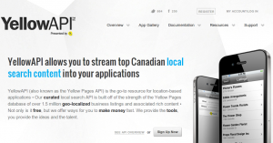

Yesterday we had our first data discussion at the offices of Truvo. Truvo is the provider of the Print (pages d’or/gouden gids) in Belgium, but also the largest Internet agency in the country. It turned out to be a very inspiring meeting. Thanks to all attendees and Truvo for hosting.

Truvo logo

### **What data?**

Truvo distributes both the white and the yellow pages in Belgium and next to that truvo has established the largest internet full service agency for SME customers selling internet solutions from 20€ per month. They have 25K website customers, are the largest Google reseller, as well as Facebook, beweb, sanoma and other local media.

This means they have an incredible amount of data, which they check regularly, which gives them a lot of administrative update work. But Truvo is a private company, so they earn their money, not by selling the data itself, but by selling a return on investment for business owners on directory listings and e-services agency products such as websites, P4P, video, adwords and banner advertising. They launched several services like sayso.be, mysite web platform and performance based products. In the future they want to open the data they have on 800.000 business places and 10 Mio White page listings to partners in an Open distribution Network in order to create more reach into the long tail of the internet, and thereby giving the Truvo advertisers a even better return no investment. Next to that Truvo wants to investigate an Open Contribution Network to enable contribution partners improve the ROI for its customers.

### Canada

A good example of the way to go is Canada. It was brought forward several times during the discussion as an example where Belgium can easily get in 1 to 2 months.

Yellow API . com

This is a read-only (distribution and syndication) API where your can query the yellow pages. It allows any website to earn money, as it shares the revenue of possible ads that you may show in your application. The geolocations present in that API are more accurate than the geolocations in Google Maps as the company behind Yellow checks this on a regular basis. Inside the API you can easily match twitter, foursquare and personal Yellow Pages account to get more information in one HTTP request.

### Open Data?

After discussing their current business model and competitors, we dived deeper into the legal aspects. To use their data, we had to agree on a 16 page terms of conditions, which we had to sign manually, and which contained a lot of pitfalls resulting the fact that every possible use-case could be seen as illegal, somehow. But, this was just common practice, dixit Truvo, this was a standard agreement from the Canadians which made it easier for other people to agree on the “open” API. Now OKFN Belgium has been asked to review the agreement and we will try to come to a consensus, to be able to use the data for [Apps For Flanders](http://appsforflanders.be 'Apps For Flanders').

Truvo coined us an idea for OKFN: what if OKFN could start a label – a stamp – to put on license agreements. If people could easily see what the license is about, then they can easily comply to it. As currently there is no good license structure in place for data, I think this is a very interesting thing to do. This will be a point on our next board meeting.

### On a side-note

The register for all companies in Belgium (KBO) may become open data soon, as open data will become common practice in government services. This dataset contains similar data than the Yellow Pages, Truvo will look for opportunities to work together with the government, and is already working with KBO. Eventually, in an ideal world, there will be one dataset that will be used by third parties to work on as a common resource. Wouldn’t it be better for Truvo to start working on a real open data policy now, before it’s too late?

It was a very inspiring discussion and we’re planning to do a second one very soon, now focusing more on the technical aspects and possible ideas. Let’s keep in touch.

[Pieter](http://twitter.com/pietercolpaert 'Twitter')
