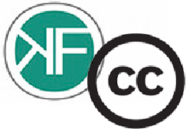

I’m happy to announce that from here on out Creative Commons Belgium will cluster with and be sited under the OKFN Belgium organization!

Since the start of 2012 the Belgian Creative Commons affiliation has been reanimated by a brand new team. The new CC-BE team consists of both people from the former formation and some fresh blood. There currently is an open position for Legal Lead available to all who is willing and able, although an academic background in copyright is preferred. In meantime Séverine Dusollier, head of Intellectual Property Rights at Centre de Recherches Informatique et Droit at Namur and former Project Lead of CC Belgium, will continue to take charge of all legal matters. The position of Public Lead will be taken on by myself.

As CC Belgium and OKFN Belgium are practically pursuing the same goals of promotion and education concerning “the power of open” we concluded that we could mutually benefit from an extensive form of collaboration. In practice this means that CC Belgium will constitute a new workgroup within the organization of OKFN Belgium and furthermore we are looking for joint projects wherever possible. For the remainder of 2012 CC Belgium will focus on setting up an organizational structure and a decent informative website. Of course we are always looking to expand and consolidate our network and if anyone might be interested to make a contribution to the CC Belgium project, you are more then welcome to join our team. I strongly believe this marks the start of a successful collaboration and a new chapter for the copyleft community in Belgium!

<address> You can get in touch or stay informed by subscribing to our mailinglist: https://listes.domainepublic.net/listinfo/cc-be</address><address> </address><address> *Yannick H’Madoun* *Public Lead Creative Commons Belgium*</address>
