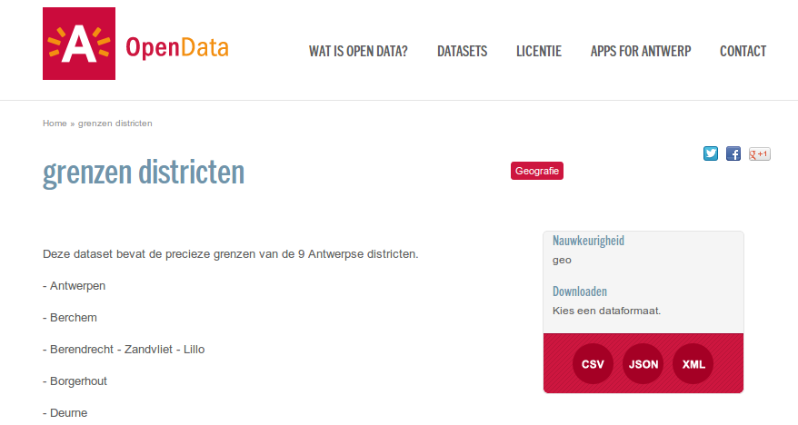

Antwerp launched its own Open Data Portal. The data is made available one month before [Apps For Antwerp (8th of December).](http://opendata.antwerpen.be/nieuws/apps-antwerp)

District borders for the city of Antwerp. Will this deliver a new [Ghendetta](http://ghendetta.be) at [Apps For Antwerp](http://appsforantwerp.be)?

More information:

<http://opendata.antwerpen.be/>
