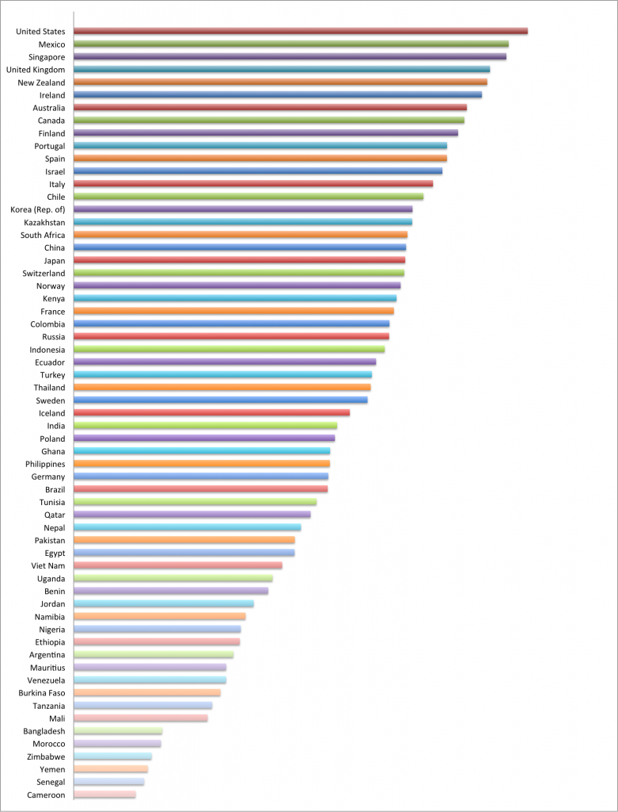

In September, the [World Wide Web Foundation](http://http://www.webfoundation.org/ 'World Wide Web Foundation') published the first version of the [Open Data Index](http://www.webfoundation.org/2012/09/introducing-the-open-data-index/). It is part of the [Web Index](http://www.webfoundation.org/2012/09/web-foundation-launches-the-web-index/), which measures topics such as communications infrastructure, policy, content availability, use of social networks, business use, freedom of speech and e-participation, based on over 80 indicators.

[14 of those 80 indicators](http://thewebindex.org/documents/2012-webindex-dataset#Q22) look at open data:

- Government use of open licenses
- publication of trade data on the Web
- publication of fiscal data on the Web
- Publication of health data on the Web
- Publication of education data on the Web
- Publication of transport data on the Web
- Publication of census data on the Web
- Publication of map data on the Web
- Tax filing via the Web
- Information on contacts in government departments
- Publication of crime data on the Web
- Ease of access of government data
- Extent of Open Government Data Initiative
- Creation of new services based on government data

[These are the results for the first year:](http://www.webfoundation.org/2012/09/introducing-the-open-data-index/od-index/)

The results and [methodology](http://thewebindex.org/2012/09/2012-Web-Index-Key-Findings.pdf) of the study have been [severely criticised](http://www.access-info.org/en/open-government-data/302-spain-is-a-world-leader-in-open-data-says-who) by some Spanish organisations, who felt that Spain was wrongly portrayed as a leader in open data. They complained about how the results were based on perception of only one person. In fact, the Web Foundation based its findings on a combination of existing data from other sources and a questionnaire for experts in each country.

While an in depth comment on the study and the indicators would require a more thorough review, some first thoughts on the survey:

- Most of the indicators are related to the availability of data, rather than the openness. As the Spanish critique says, maybe it shouldn’t be called an open data index…
- Granted, it is difficult to find good indicators relating to the availability of data, licences, etc. However, a question like “To what extent are government agencies publishing information on the web using open licenses? \[1 = not at all; 10 = extensively\]” ‘(for indicator 1) leaves a lot of room for different interpretations and perceptions. What is extensively? Does it mean that a lot of agencies publish their data under an open licence, or is it sufficient that a few organisations publish a lot of datasets? This raises the question on what indicators could work for measuring open data. Any ideas?
- 61 countries were measured, from the US to Cameroon. Where is Belgium?! It seems almost ludicrous that sufficient data would be available for a considerable number of developing countries, and not for Belgium, or that no Belgian experts could be found to fill out the survey. Does this mean that Belgium is not even a blip on the open data radar? Something to think about, I would say…
