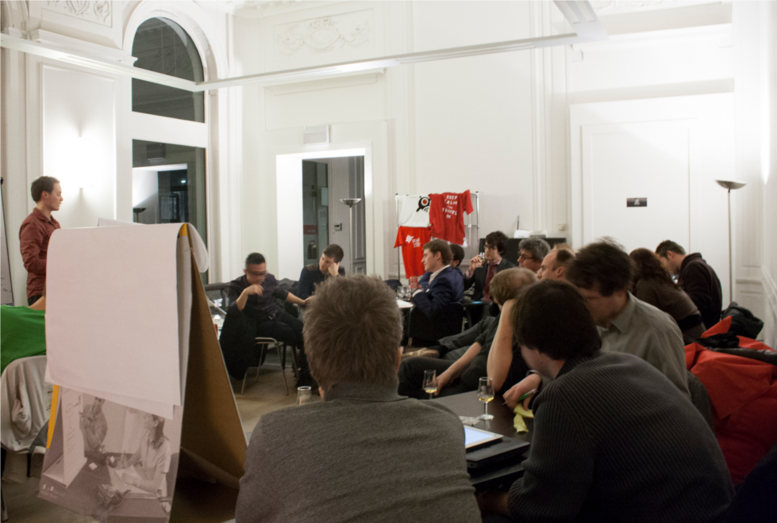

_Apps For X is the working group led by Lieven Janssen which supports people who organise Apps For X events. With a bunch of volunteers he is setting up various events next year, including Apps For Ghent, Apps For Belgium, Apps For Students, Apps For Geo, Apps For Coast with Apps For Flanders, Apps For Ghent, Apps For Antwerp and Apps For Whisky as an example._

Apps For Whisky? Yes!

Apps For X events have always been more about networking than about the apps. Before everyone starts cursing in my general direction, let me explain. Out of all apps in the application stores, there are maybe 0.01% (mere guess) that keep getting used and keep on getting downloaded.

This is not a problem for open data, it’s a problem for apps. Apps, or applications, is a broader term than just the apps we can find in an appstore. Data applications are the result of applying data to something. Students, teachers, researchers, employees, developers, freelancers and so on need to know that these datasets are in the open and they need to know where to find them. It’s not the one killer application that we are looking for, it’s the integration of a lot of datasets in a lot of applications, whether they are usable on a smartphone, whether they are used to bolster a statement or whether to visualize something nifty.

Are our Apps For X events useful as a hackathon? Sure they are. We have gotten small “hits”, for instance [Ghendetta](http://ghendetta.be 'Ghendetta'), and we have had a lot of feedback on our platform The DataTank. As a networking event they are even more useful. They show to policy makers what people can do nowadays.

Our Apps For Whisky event was just that. A blend (pun intended) between good whisky and an open data possibilities chat.

The winners, who took home a 50 year old whisky, were bloggers [adramaday.com](http://www.adramaday.com) (Bart), [onversneden.com](http://onversneden.com) (Johan) and [whiskynotes.be](http://whiskynotes.be) (Ruben), and Michael De Blauwe.

A first special thanks to the [whiskyman](http://thewhiskyman.be/), who sadly couldn’t make it, for this wonderful evening. A second special thanks to Mathias Van Compernolle who was our host for the night.

Pieter
