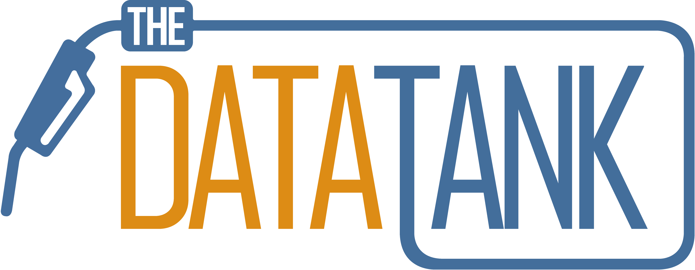

Communication is key in so many projects, and especially in community driven projects like The DataTank.  
That’s why in the past we have organized some meetings to see if our project was still aligned with the needs of our stakeholders.  
The feedback we’ve gotten from these meetings were picked up in our 2012 road map and implemented as good as possible. Now, in 2013 we’re proud to announce that, not only do we have a new repository and approach for our project, but we’re also involved in exciting open data projects.

To communicate the changes that will arise from this, and to explain what benefits and functionalities the stakeholders can expect this year, we’re organizing another user group meeting on March 13. As always, feedback is key on these meetings, as the stakeholders themselves will use the software to enable open data policies and projects.

Open data is starting to rise to the attention of not only the large cities such as Ghent or Antwerp, but also starting to tickle the inspiration of smaller cities and villages. It’s key that this year not only large cities get their hands dirty with our open data tool, but that we provide a package for smaller villages and organizations to make open data flourish. An incentive that makes the crowd ready is our very own Apps for X. The events that arise from the Apps for X incentive, such as Apps for Geo, Apps for Culture etc. should show the value that open data can offer, and make people warm to start new ideas around open data usage and apps. With that said I’m most certain 2013 will become a very important year for open data, and we at OKFN Belgium are here to help making it happen!
