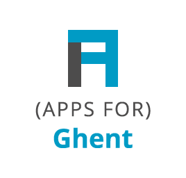
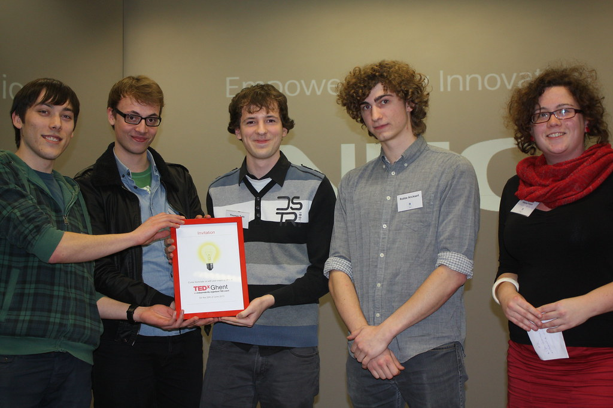

Apps for Ghent has been organised for the third time. It is the ideal moment for citizens of the city of Ghent to show that Open Government Data can make the life of citizens easier, better or more fun. This edition welcomed 15 teams. The teams invented concepts from a smarter government service, to participation and sustainable energy.

The organisers (OKFN Belgium, the City of Ghent, iMinds, Ghent Web Valley and Ghent living lab) are very satisfied with this edition. Apart from the contest, it has shown to be an excellent place to network as well.

Apps for Ghent is not the only Apps for X event. Soon there will be Apps for VDAB, Apps for Flanders, Apps for Geo, Apps for Culture and many more. A full list can be found in our [calendar](http://okfn.be/calendar/ 'Calendar').

**The laureates**

The local jury awarded Sumocoders with the first prize for “[how busy is it now](http://hoedrukist.nu/)”, a tool that analyses different data sources to estimate which squares are too crowded.

The second prize went to the team 9K, a student team from the Artvelde Hogeschool. With “the city is your playground”, they created a tool which can be used to crowdsource city development projects in a very nifty way. 9K will be present during the _open Summer of code Ghent_ which we organise during the first 3 weeks of July.

The international jury, with jury members from Russia, Greece, The Netherlands and France, awarded a student team from the university of Ghent with the Apps for Europe prize. The underlying message was of course to make their “find the nearby pharmacy that is opened” app available on a European scale.

Essent.be support Apps for Ghent with their data, but also awarded the team RMϞRF the Energy prize for their app Enerxia. A game which raises awareness amongst citizens about their energy consumption.

Finally, there was the TEDxGhent prize for the best presentation. This prize went to 9K. The team has been awarded a speaking slot at TEDxGhent, the 22d of June 2013.

The team 9K receives the TEDxGhent prize

