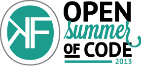

During the summer, a lot of companies hire students for a 1 month job. A student will work on a project that no one had time for before. Rumour has it that when you hire students, only 10 percent of the students are going to deliver something worthwhile. After the job, students go back to studying and the work is left untouched until the next summer, where the new students may decide to do it all over again.

Open Summer of code is raising the bar. We believe that using modern management techniques# every student can be the 10 percent. Per team of 4 or 5 students, 1 freelancer from inside OKFN Belgium is going to be managing one or more teams extensively. This leads to the ultimate learning experience for the students, while still coming up with the best they could make for the time given.

Open Summer of code is going to be organised for the third time. Previous events were called [iRail Summer of code](http://hello.irail.be/irail-summer-of-code-12/) (#iSoc11 and #iSoc12).

The students are sponsored by external companies. Sponsoring goes from €2,800 to €11,200. The company may sponsor an idea of their own, or may sponsor an OKFN Belgium project.
