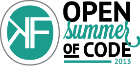

 This Monday, Summer of code is starting. It is an event where 20 students will work on various open source projects with open data. They are hired thanks to a lot of interesting partners: NMBS Holding, Essent.be, the City of Ghent &amp; Digipolis, IBM, MMLab &amp; iMinds, Mobile Vikings, Ontoforce and our own iRail open transport working group’s SoLoMIDEM project.

We have a server outage on summerofcode.be today, but on Monday we will be back with a bunch of news!

Pieter
