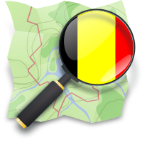

_The Open Street Map Belgium (OSM Belgium) community is joining the Open Knowledge Foundation Belgium (OKFN Belgium) umbrella. As OSM is now a working group at OKFN Belgium, Ben Abelshausen is joining the board of directors of OKFN Belgium – officially after the next general assembly in February 2014 – to help represent the Open Knowledge scene in Belgium._

“Do we need a legal organization to represent us?” is a question that was frequently asked by the Belgian OSM community since a couple of year. Some were answering: “why do we need such organization? We are okay now.” Other community members were thinking about public communication for our project, recruiting new contributors, applying for government grants, being able to finance meetups, and so on.

The last month the number of projects were increasing and the need for a legal organization was growing fiercely. When Pieter Colpaert proposed us “join OKFN Belgium! We can do things together!”, the decision was quickly made, as our goals are very similar. Today we can proudly announce OSM Belgium joins OKFN Belgium as a working group.

With this news, OKFN Belgium’s umbrella is growing in a great way! Not only are we growing bigger as a data reuse community, but we are also representing a new community of data publishers. OKFN Belgium believes this data forms one of the key datasets in our daily lives.

Ben Abelshausen, Nicolas Pettiaux, Julien Fastré (OSM Belgium) and Pieter Colpaert (OKFN Belgium)

**More info information about the OSM Belgium community:**

[http://wiki.openstreetmap.org/wiki/WikiProject_Belgium](http://wiki.openstreetmap.org/wiki/WikiProject_Belgium)

**Want to become a mapper yourself?**

[http://wiki.openstreetmap.org/wiki/Belgium#Start_with_OSM](http://wiki.openstreetmap.org/wiki/Belgium#Start_with_OSM) (in French: <http://openstreetmap.fr>)

**Want to start reusing the Open Data?**

Download data dumps over here: [http://download.geofabrik.de/europe/belgium.html ](http://download.geofabrik.de/europe/belgium.html)

**Want to meet some of the community members?**

<http://www.meetup.com/OpenStreetMap-Belgium/> or follow [@osm_be](http://twitter.com/osm_be)
