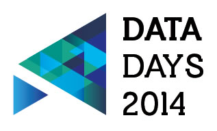

We have already sent out a Save The Date for Open Belgium, the conference part of [Data Days 2014](http://datadays.be) in Ghent the 17th of February. As part of Data Days (#dd2014), we are also inviting project developers to compete in a hackathon. This is not what you’re used to though…

The stakes are high! We have a total amount of prizes of **€35.000** (and extras) split in 3:

- **€ 5.000 + a trip to pitch your app** in e.g. Manchester for “citizen developers”: you are not a real programmer but you are interested in datasets for your city and tweaking apps to your needs. You are coming \*this Thursday\* to Sint Laureins meet data owners, learn to use the datasets, network and get explanation about some tools that can be used ([register here](http://www.v-ict-or.be/form_submissions/new?form_id=52793f80ce3fb559cc000007))
- **€ 10.000** for a professional app that helps to fight poverty. The award ceremony of this app will already take place the 13th of December. As well this Thursday you will be able to meet people who have identified social problems, but don’t have the skills to develop them. If you implement one of these ideas, you’re raising you chances.
- **€ 20.000** for an app that re-uses the very fresh Open Data from the VKBO (register of companies in Flanders and Belgium). With the 20k, you are supposed to keep your app up and running afterwards or to use it as seedfunding for your start-up.

This Thursday at Manage IT in Sint Laureins, the website of Data Days will be launched and the hackathon will be kicked off. [Feel free to stop by](http://www.v-ict-or.be/nieuws/citadel-on-the-move-hackathon-sleep-jij-5-000-10-000-of-20-000-in-de-wacht)!
