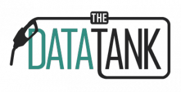

**The DataTank is taking it to the next level. New version. Professional support.**

The DataTank is open source software, just like CKAN, Drupal or Elastic Search, which you can use to transform a dataset into an HTTP API.

The DataTank has come a long way, since the idea was conceived by Bart van Loon in 2008, it has been taken over by Pieter Colpaert in 2010, to then be managed by the Open Knowledge Foundation Belgium. Today we are proud to launch a more stable code base on which professional support will be provided.

Want support for The DataTank in your organisation? Contact our team at <info@thedatatank.com>

To get an idea of what The DataTank can do for you, check <http://thedatatank.com> or the [demo website](http://demo.thedatatank.com).

If you’re from Belgium, you might be interested in joining [our release drinks the 13th of December](http://thedatatank.eventbrite.com).
