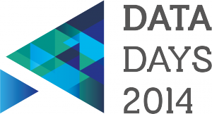

Some of you might have seen the video on the [home page](http://openbelgium.be/) about the Open Belgium conference we are organising. So now we want to officially invite all the Open Data ambassadors and enthousiasts to Open Belgium. It is the first day of a three-day conference called [Data Days](http://www.datadays.eu/) and is organised by OKFN Belgium. From 17 till 19 February, all those passioned about Open Data, national and international, will be gathering in the city of Ghent. This conference will focus on the actual use of Open Data in the field, not just on the theory behind the idea.

With this event, we aspire to be one of the leading Open Data conferences in the European region. But the quality of a conference is only determined by it’s participants and that’s why we would love YOU to come to the conference. Because just like us, you have a certain predilection for Open Data and that’s why we would love to have you there to share your opinion and knowledge on Open Data use in Belgium. Because it doesn’t just matter who’s on stage, for us it’s important that we have the right people in the audience as well. Their impact can be even greater.

For a limited numbers of participants we also provide an entrance bursary. If you want to attend this event but you have no budget, please fill in the google form through the link below.

All new information about the conference will be shared through the Twitter hashtag [\#ddays14](https://twitter.com/search?q=%23ddays14&src=hash). Feel free to use the hashtag to let us know how you feel about this conference.

Here is the information about what will take place:

The DataDays conference itself is a joint effort of the [Open Knowledge Foundation (OKFN)](https://openknowledge.be/), The European project [Citadel on the Move](http://www.citadelonthemove.eu/) and the [Linked Organisation of Local Authority ICT Societies (LOLA)](http://lola-ict.org/).

The program allows you to travel from Open Belgium to Open Europe and to arrive at Open World:

[**Open Belgium (17 Feb)**](http://www.datadays.eu/open-belgium/)  
Open Belgium will host several keynote speeches about Open Data by policy makers in Flanders, Wallonia and Belgium. Break-out rooms will also host various workshops on specific subjects such as Open Transport in Belgium, Open Street Map in Belgium, the use of creative commons licenses, and the Belgian datasets that are most wanted to be opened up next.

[**Open Europe (18 Feb)**](http://www.datadays.eu/open-europe/)  
Citadel on the Move presents an Open Forum to policy makers and influencers alike to discuss the future of Open Data in Europe. The first results of the project, which allow cities to publish their data in a way so they can easily be used in a mobile app, will be demonstrated. And the winners of the Hackathon come on stage to show their apps.

[**Open World (19 Feb)**](http://www.datadays.eu/open-world/)  
Open Data is a global phenomenon. Its true implications only become apparent when looking across borders, across continents. The Data Days provide a platform for experts and enthusiasts from all over the world to get in touch, share experiences and exchange strategies so that Open Data may shape the future for all of us. Key topics will include interoperability of Open Data between European cities and regions, Open Data licensing and business models.

**Registration**  
You can choose different modules or go for the full conference package.  
Visit <http://www.datadays.eu/registration/> to find out what fits you best and register now!

**Conference venue**  
The conference will be held in Ghent, Belgium, from February 17 – 19, 2014.  
Day 1: STAM (located at the Bijloke site) – Day 2 &amp; 3: De Bijloke (nearby STAM)

**Conference program**  
Visit <http://www.datadays.eu> and check out the full program.

**Entrance Bursary**  
You can enter your information for an entrance bursary through <http://bit.ly/1fv6DVx>. The deadline for this bursary is the 31st of january. If you have any question about the form or the bursary, please mail to pieter-jan.pauwels@okfn.org.

Join us and other Open Data pioneers, practitioners, thinkers and researchers from across the world. We’d love to have you there and join the discussion on how we can use Open Data in a structural and sustainable way.
