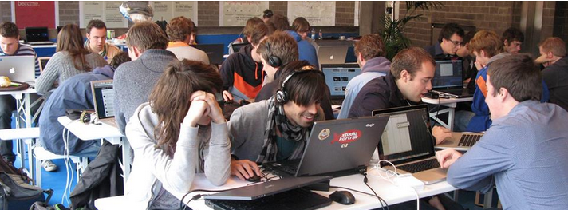

The city of Kortrijk kicks off the Open Data and hackathon season with Apps4K.

From 30 January 2014 until 1 February 2014 application builders and creative minds are welcome to join the event in the Buda factory in Kortrijk to work with Open Data, made available by the city of Kortrijk. During this three-day event, participants wil be accompanied by experts in developing an innovative application. On thursday the 30th of january, they kick of with a set of interesting keynote speakers. On friday the 24 hour long hackathon starts for all the participants. During the hackathon, the participants can use, aside from a lot of useful data, numerous amenities such as different smartphones and tablets. The main intention during those 24 hours is to use the data of Kortrijk to develop a user-friendly and sustainable application.  
On saturday the judges will decide which of the apps will be rewarded.

Are you up for the challenge and have a heart for Kortrijk? Don’t wait any longer and [enter on the website!](http://www.kortrijk.be/apps4kortrijk)

