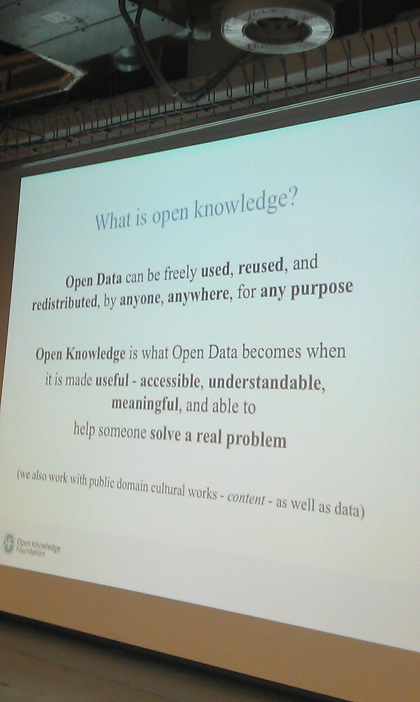

**OpenKnowledge is what happens when OpenData become useful.**

> MT [@zoerobinson1](https://twitter.com/zoerobinson1): What is [\#openknowledge](https://twitter.com/search?q=%23openknowledge&src=hash)? It’s “what [\#opendata](https://twitter.com/search?q=%23opendata&src=hash) becomes when it is made useful” [@hubwestminster](https://twitter.com/hubwestminster) [\#OPD14](https://twitter.com/search?q=%23OPD14&src=hash) [pic.twitter.com/MZgGG4KHjF](http://t.co/MZgGG4KHjF)  
> 
>
> — Open Knowledge Fdn (@OKFN) [January 23, 2014](https://twitter.com/OKFN/statuses/426431427476226048)

Some OpenData providers can see this as a reason to import data into  
OpenStreetMap and its versatile ecosystem of tools and applications. This would  
increase visibility of the data and perhaps generate some of that Open Knowledge.  
OpenStreetMap is a community of mappers with a sole purpose of mapping the  
entire world. Sometime these mappers cannot resist some of the fresh juicy  
Open(Geo)Data and also want to import this into OpenStreetMap.

For those that don’t know about this yet, imports are a controversial issue in the OpenStreetMap  
community. There are problems of accuracy, licensing, updates, community health,…  
You can read more on this on: [Why Imports in OpenStreetMap are controversial](http://blog.emacsen.net/blog/2014/01/25/why-imports-in-openstreetmap-are-controv%20ersial/)

The session organized by the OpenStreetMap-BE working group at the DataDays is  
about this subject. OpenStreetMap has a complicated hate-love relationship with  
external open geo data but there are a lot of opportunities here for both the  
OSM-community and the providers of open geo data sets.

The first goal is to try and clearly state the view of the OSM-community on importing  
external datasets and the many misunderstandings related to this. We would also  
like to point out some opportunities OSM can offer for data providers or  
organisations that open their data. Why only import your data when you can  
become of member of the OSM-community. The final goal of this session should be  
an answer to the question: Is there a better way to cooperate and to improve all our  
datasets?

In more detail we will try to formulate an answer to these questions by using a  
discussion panel. We have invited different people from different organisations that  
will bring a variety of views to the table:

- Tom Van Herck from AGIV (The Flemish Geographical Information Agency)
- Joost Schouppe, OSM-mapper &amp; City Of Antwerp
- Ben Abelshausen, OSM-mapper, OKFN-BE board member
- Bart Rousseau, Stad Gent &amp; OpenData-man

At the end of this session we hope to walk away with some ideas that can bring together the OpenStreetMap-community and the open-data community to improve  
the quality and access to some of the open-geo-datasets and OpenStreetMap.

More information about our session can be found on the [datadays website](http://www.datadays.eu/session/open-steet-map-belgium/).

Happy Mapping!
