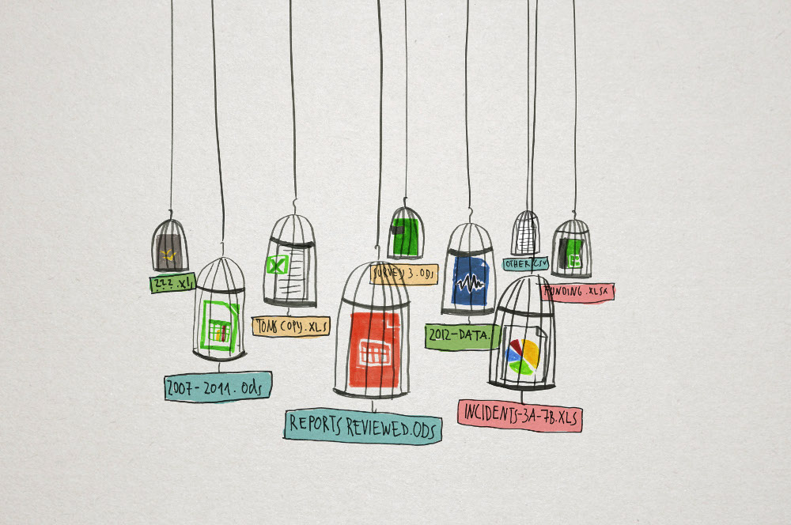

Although there’s a lot of attention paid to Open Data, we must not forget that the pursuit of opening public datasets and the corresponding open data movement, is still a rather young movement, and that each day people undertake steps and tackle boundaries towards a more open future.

The big potential of Open Data is ought to be in the creation of economic value, where open government data is seen as low hanging fruit. The idea is that Open Data are public goods and they belong to the society who paid for the creation of it and they could be as gold and oil for those who get started with it. In the meantime this openness implicates some societal impact as well: the raise of a new dimension in governmental transparency and it allows citizens to interact with government in a new way.

**One of the futures evolutions: a transition in eGov.**

Where the benefits for releasing data and making it reusable is claimed to be found in the economic sphere, I think that benefits and new innovation can be found in the creator of the data: governments itself. Open Data then can lead to efficiency gains and create an indirect economic growth by making government a beneficiary of its own efforts.

> “Governments opening their data is one thing; making them useful and usable by releasing them in a machine readable format, is another”,one of my best colleagues learned me.

With the aforementioned he pointed at the fact that when open datasets are structured in a standardised way, on a technological level ‘communication’ is possible between a dataset or a software program. This technological ‘interoperability’ supports the creation of a common understandable semantic ‘language’, that on its turn facilitates organisational processes becoming more aligned.

The use of open standards, where the introduction of the [OSLO](https://joinup.ec.europa.eu/catalogue/asset_release/oslo-open-standards-local-administrations-flanders-version-10?lang=nl) format (Open Standard for Local Administrations) is a first milestone in Flanders, then creates the possibility to enhance this interoperability idea. Using new standards can make it for administrations possible to communicate between departments and entities in one organisation, as well as with governmental bodies and levels outside the organisation.

One of my most wanted working fields for Open Data is thus government itself: next to the fact that Open Data promises transparency and stimulates new ways of civil participation (for example via the development of social innovative applications and data-driven (citizen) journalism – it leads to a new dimension in eGovernment.

On the 17th of February during the [Open Belgium Conference](http://www.datadays.eu/open-belgium/), I would like to extend this discussion during the ‘[Open Data Most Wanted](http://www.datadays.eu/session/open-data-most-wanted/)‘ break-out session. The session itself is not a panel or a keynote, but a brainstorm where Open Data experts and individuals without any IT-background alike can share how they see this evolution and what data should be open. The outcome of this session will be the basis for a plan of action in order to open up more valuable and wanted data in Belgium. So feel free to join us at the [Open Belgium Conference next week](http://mijnevent.be/nl/event/50971/data-days).

Image Source [Drawing by Numbers](https://drawingbynumbers.org/), [(CC) BY-SA](http://creativecommons.org/licenses/by-sa/3.0/deed.en_US)
