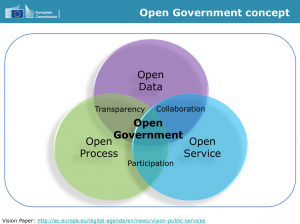

“8 principles of Open Government Data” is the title of the now famous manifesto published on December 8th 2007. Over time, the word “Government” was often dismissed, and much pre-eminence was awarded to the word “Data”! Although an important concept, Open Data is all but a _modus operandi_ to implement Open Government, which is a public policy’s philosophy rather than a political strategy. Public actions are aimed at citizens and Open Government may help better shaping e-Government initiatives supporting those actions.

E-Government is a strategy to provide administration services online, so-called digital government. Yet, the number of services available online via Internet is not a measure of success, and the real issue is how to provide better services to citizens. With Open Data, which is a first step towards more transparency, one can start implementing Open Government strategies to ensure more participation and accessibility for everyone. Open Government is not only about providing more Open Data sets through something like data.gov, it is really about making sure “Government is where people are !”.

In a recent event hosted by the EU Commission, Open Government concepts have been strongly re-emphasized for ICT-enabled Public Sector to deliver the real benefits.

Indeed, “there is sometimes confusion that the (sole) adoption of an Open Data platform creates Open Government in and of itself. This is not the case – Open Data alone is not sufficient to create an Open Government” (S. Spiker).

Even on Twitter we are witnessing that line of reasoning: #OpenData + #Hackathon = #OpenGov with the wrong message sent out to the developer’s communities. “We gave you some of our data (awesome), we want you to do stuff with it (nice, thank you), and hence we now have Open Government (not quite)” (S. Spiker).

Over the last 4 years, citizen’s attitudes toward our government’s decision-making processes have changed. “There was a time when citizens trusted objective professionals and elected officials to make those decisions \[…\].; this is no longer the case, the Internet accelerates the decline of deference \[…\]. It’s not that we don’t trust; it’s just that we want to verify.” (D. Eaves)

Yet, is “transparency” the new objectivity? And, is “openness” really more than a personality-trait? Why “honesty” shouldn’t be more rewarded i.e. authentic raw data re public actions are made public? And, could empowering the administration to use social media tools as well as connect with external communities gathering citizen-generated information be a better approach to foster collaboration? Recent improvement of the French data.gov, allowing user-generated content to be stored along public data is one example of this social move.

Last but not least, Open Government is not much about transparency in decision making than about legislation making. It is a philosophy allowing citizens to provide their Government the benefits of their knowledge and collective intelligence through participation. We welcome you to elaborate on this subject during our [break-out session](http://www.datadays.eu/session/egov/) during the [Open Belgium conference](http://www.datadays.eu/open-belgium/).
