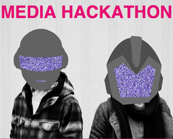
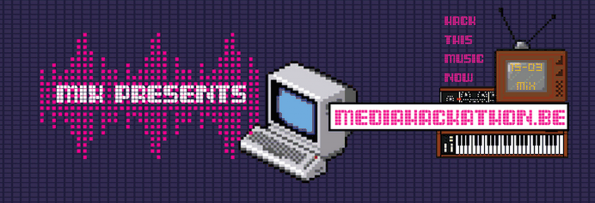

We’ve blogged about a few hackathons before but this one deserves a separate category. So what is this [mediahackathon](http://www.mediahackathon.be/)? Simple, on saturday 15 March at 11 AM developers and creatives will gather at the Ancienne Belgique in Brussels for a 24 hour hackathon with different media sources and formats. The results will be shown live during a [Compact Disk Dummies](https://soundcloud.com/compact-disk-dummies) concert in the AB on the 1st of April. Your future hack can be in relation to the show, the music, a videoclip or any other mediatype.

During the hackathon there will be plenty of workshops providing you with all the answers about Audio API’s etc. Besides the hackathon the Compact Disk Dummies will use or show your hack during their show live in the AB. So you will be able to demonstrate your hack during their music show. Apart from showing it, MiX will also film the results and share it with the world.

The audio API, provided by MiX will add some cool real-time audio features, so hacks can use live music from the Compact Disk Dummies. You’ll be able to receive real-time data about the amplitude, frequency, tempo and instruments on the fly. You can use these parameters to make something creative with music and media. Want to hack something that creates music itself in stead of visualising it? Go ahead, they’re open for different ideas and media mash-ups.

MiX provides the necessary datasources in JSON Format, but feel free to mix it up with other datasources, media and social channel feeds.

So what’s to gain? Fame, A live performance next to the Compact Disk Dummies and a creative hack that Compact Disk Dummies will use on tour.

**Agenda**

——————— Sunday 15/03 ———————  
10:00 Doors  
11:00 Practicals  
Challenge by Compact Disk Dummies  
Info about data, media sources, API’s and technology  
Inspirational Demos  
12:00 Kickoff Hackathon  
13:00 Lunch  
14:00 Workshops  
Visualization  
Audio API  
Websockets  
19:00 Food, Beer &amp; Music

——————— Sunday 16/03 ———————  
00:00 Midnight Pizza  
|  
| Die hard Drinking &amp; Hacking  
|  
08:00 Awesome Breakfast  
10:00 Deadline Hacks &amp; Presentations

——————— Tuesday 01/04 ———————  
iMinds Media’s “Ideas Brought To Life” event @ AB

**Practical**  
The hackathon is on saturday the 15th and 16th of March.

Doors open at 10AM  
Hacking starts at saturday 12PM and you can work until sunday 12PM. You can bring a sleeping bag and a matras if you’d like to rest up. The whole event will take place in House 23, the location is above the AB Café (steenstraat 23, 1000 Brussel). It’s a nice and roomy place where we all can hack, make music en can meet each other.

Bring your own laptop or PC, MiX provides the power, food and drinks and a decent network (ethernet + WiFi). Come alone, or in group, we can work with al types of group and you can still form a group with someone during the event. Live demo’s are on the 1st of april. If you can’t make it on the 1st of april, someone of the MiX team will present your application with lot’s of care and awe. Everything will be filmed so you’ll be able to watch it anyway.

Why a Mediahackathon and what is [MiX](http://www.iminds.be/en/develop-test/mix)? Mix is a research department of iMinds, creating creative and innovative events in and about the Flemish media. Among the MiX’ers there are 5 strong media hackers, also called Mixers who will guide you through the hackathon: Matthias, Kasper, Lode, Robby and Sam. If you have any question for them about the hackathon, you can always contact them on <demixers@mediahackathon.be>.

Seats are limited and signing up is possible until saturday. So hurry up and join.
