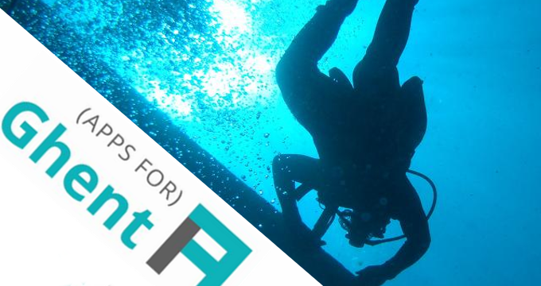

May the fourth be with you. Oh yes, the fourth edition of [Apps For Ghent](http://appsforghent.be/) is right around the corner and to inspire the digital minds in Ghent, we’re organising a data-dive on the 11th of March.

**Datadive?**

Don’t worry, you don’t need a wetsuit. The data owners providing the data for the Apps For Ghent hackathon will tell us more about their datasets, how they are maintained, for which purposes they exist and what the challenges considering policy are. The datasets belong to the Ghent environment service, the green maintenance service and the health service. So let’s make applications that are ‘lean’ and green.

After the session about the data there is room for some brainstorming on possible projects during Apps For Ghent on the 22nd of March. So you’ll be ready and inspired for the hackathon itself.

**Interested?**  
Come and join us on 11 March 2014, confirm by signing up on [Eventbrite](http://www.eventbrite.com/e/datadive-data-voor-een-duurzaam-gent-tickets-10799574819)

**Address:**  
AC Portus

Keizer Karelstraat 1 – 1st floor

9000 Ghent

**Schedule:**  
18h30 Reception

19h00 Start data explanations

20h00 Brainstorm ideas

21h00 End

Original image source by [DiverJim](http://www.sxc.hu/photo/1295077) provided by [the SXC Image Licence agreement](http://www.sxc.hu/help/7_2)
