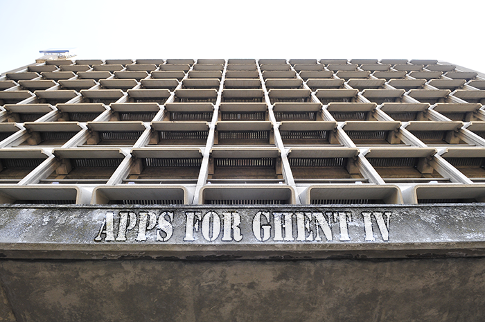

If there is one thing we learned from (co)-organising hackathons, it’s that they’re fast and full of interesting talks and tracks. [Apps For Ghent](http://appsforghent.be/) is no exception and it’s this saturday. We give a quick oversight of the programme to mentally prepare and figure out what concept you’ll be working on this year.

# START!

**09:00 Reception and breakfast** Stack up on the coffee and couques, sugary energy for everyone.  
\+  
Speedtalk about [The Datatank](http://thedatatank.com/)  
Jan Van Steenlandt will give you a speed course in using and finding the right datasets with the Datatank, which is the system running behind [data.gent.be](http://data.gent.be/).  
\+  
Short introduction of the datasets of the City of Ghent and Sensolus  
The city of Ghent has some [new datasets](http://appsforghent.be/2014/03/17/data-voor-een-duurzaam-gent-verslag-van-de-datadive/) (Dutch) ready for you and [Sensolus](http://www.sensolus.com/) will get you up to speed about the sensors that you can use live, as well as using data from sensors that already gathering data as we read on.

**09:30 Start Hackathon** Find your buddies, take out those laptops and get started. You have until 16:00 to work on your idea.

**10:30 – 12:30 : Apps for dummies (1st floor)**  
[ Apps For Dummies](http://appsforghent.be/2014/02/26/workshop-apps-4-dummies/) (Dutch) is a separate citizen development workshop for those who want to create an app without coding skills. Yes, you’ve heard right, now everybody can make an app. Thimo Thoeye and David Slosse will give a workshop about the neighbourhood applications based on application template developed by [Citadel on The move](http://www.citadelonthemove.eu/).

**11:00 Inspiration session 1: How can sensor data support relevant applications?** Still wondering how you can integrate sensor data into your concept? No worries, Johan Criel and Laurence Claeys from Sensolus will give an inspiration session about how you can use that data.

**12h:30 Inspiration session 2 : Apps and the Ghent green pools** How can data and mobile apps contribute to the involvement around the [Ghent green pools](http://www.gent.be/docs/Departement%20Milieu,%20Groen%20en%20Gezondheid/Groendienst/Groenpolen_Gent.pdf) (Dutch)? If you don’t know what green pools are, those are the 4 big green areas that will provide the necessary room for green space and recreation around the city.

**12:30 Lunch** Time to take in more than sugar and coffee. Short foodbreak.

**14:00 CoderDojo** [Codoerdojo](http://www.coderdojobelgium.be/) starts their track for 7-16 year olds.  
The team already had a head start, but beware for these new prodigies, they learn fast.

**14:30 Datatalk 1:** Olav Peeters from [IRCEL (interregional cell for the environment)](http://www.irceline.be/) will talk about environmental data and services that will be able to provide you with the necessary data, the services that already running on it (eg. Sensor Observation Services), the legal frame and INSPIRE. There’s also some attention to Sensor Observation Services on a [Raspberry Pi](http://www.raspberrypi.org/) and possibilities for a project where data of onboard computers in car can be made available.

**15:15**  
Pieter Colpaert, not only part of Open Knowledge Foundation Belgium, but also the coordinator of the international Open Transport working group, is going to introduce the concept of Open Transport Data.

**16:00** Put down your pens…, I mean laptops. It’s time for the teams to present their results.

**17h30 jury deliberation**

17h30 Presentation and presentation by CoderDojo

17h45 Start Reception

18h45 Award ceremony

19h30 End

That’s all of it. It’s a big schedule, are you ready for it?  
If you want to come but still need a team and/or a project, why not join [the edit-a-thon team](http://openbelgium.be/2014/03/time-for-an-edit-a-thon/). I’ll be your personal assistant during the whole activity and we’ll have a blast.

Got any more questions about Apps For Ghent?  
You can always tweet to [@AppsforGhent](https://twitter.com/appsforghent) or just [mail us](mailto:pieter-jan.pauwels@okfn.org).

Trouble getting there?  
Slimweg has a whole [webpage](http://www.slimweg.be/toplocaties/ac_portus.htm) dedicated to getting to the AC Portus building (Dutch only)
