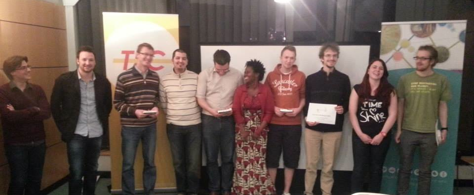

Last weekend was the [eGov mobility hackathon Wallonia](http://hackathonegovwallonia.net/) at the co-working Namur workspace hosted by our [Open Belgium ambassadors Philippe and Jean-Yves](http://openbelgium.be/members/).

**eGov Hackathon Wallonia**, is not a one time event, but a [series of thematic hackathons](http://hackathonegovwallonia.net/agenda-des-hackathons/). This hackathon was about Mobility, the next one will be around energy (more about that one TBA).

The winners of the mobility hackathon were **Open Home Chooser for the best prototype**. They developed an application for those who are looking for a new home and want to find more about the nearby facilities and the access to those facilities. With this app you can assess if a home is close to your work or has a good public transport connection to your work. This can apply to more than your workplace, you can use it for schools and other facilities that matter in your situation.

**“Qui A Charge D’Ame” won the award for the best idea**. The idea involves around helping people with certain disabilities and people of old age to guide them through the city in a safe way.

There’s a whole Storify about the Hackathon by Coworking Namur (French only).

Congratulations to the winners and we hope to see you again during the energy hackathon.

[[View the story “Hackathon sur la Mobilité 4-5 avril 2014 au Coworking Namur #HackWall” on Storify](//storify.com/CoworkingNamur/hackaton-sur-la-mobilite-le-8-avril-2014-au-cowork)]
