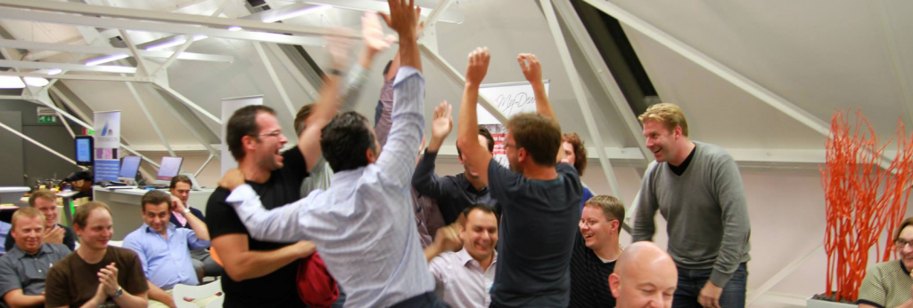

Healthcare is a very innovative industry, but its digital tools are still stuck in the last century.  
HackforHealth would like to invite you to join them in **Kortrijk on May 9, 10 and 11 for the second edition of [HackForHealth](http://hackforhealth.be)**, event dedicated to building top-notch digital tools for the healthcare industry.

**What the event is about:**

Creating new, real startups that bring innovative solutions to healthcare problems.

We start from Challenges – problems we’ve identified in the healthcare, with the help of healthcare specialists. For each Challenge they have chosen a customer already waiting for a solution, or a clear business model. Further, for each of the Challenges we see strong potential for growth across Europe.

**What we’ll ask you to do:**

Do what you do. Bring a fresh perspective. Build elegant solutions to complicated problems. Think out of the box. Some tips from the former attendees below:

**What’s in it for you:**

The opportunity of a lifetime. A chance to become a co-founder of a new startup – a company dedicated to making healthcare more efficient and cost-effective, giving healthcare professionals more time on treating people.

How big is the opportunity? Funding of course doesn’t prove anything, but…

In last year alone, nearly USD 2 billion had been invested in [healthcare startups](http://www.informationweek.com/healthcare/leadership/digital-health-startups-charm-vcs/d/d-id/1113328). And, a healthcare startup just went for an IPO at [USD 3.4 billion valuation](http://medcitynews.com/2014/03/4-takeaways-castlight-healths-ipo/).

**Why HackForHealth works?**

HackforHealth thoroughly researched the Challenges and selected them based on their real business potential. They carefully chose Team Captains – experienced entrepreneurs and professionals who will lead the teams around the Challenges.

You can find all the proposed Challenges for this edition right here: [http://www.westartup.eu/hackforhealth/](http://www.westartup.eu/hackforhealth/?do=all).

Do check the [ complete list of the many talented Captains](http://hackforhealth.be/the-event/the-captains/).

At the first event there were some real results – here’s the startup that won the first edition of HackForHealth: http://www.lindacare.com/.

**Practical info:**

- Location: MIC Vlaanderen Kortrijk, IICK, Etienne Sabbelaan 51, 8500
- Time: May 9, 18:00 – May 11, 22:00
- Fee: € 75 (covers 7 meals + drinks for you throughout the weekend)
- Sleeping arrangements: crash for free at MIC Vlaanderen (bring a sleeping pad and a sleeping bag) or stay at a hotel nearby, € 50 per night.

**Convinced?**

Get your ticket [here](http://bit.ly/hackforhealth2)!

