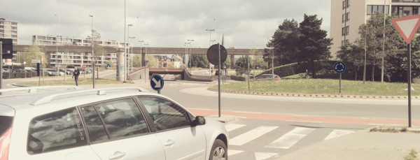

Together with the City of Ghent , the [Mobility Company of Ghent](http://www.mobiliteitgent.be/mobiliteitsbedrijf) is evolving torwards open data and wants to open up more of their available data. There was already been a [datatalk](http://appsforghent.be/2012/12/20/datatalk-mobiliteit-verslag/) around the opening up of parking data, the possibilities of this data and about the expectations of numerous developers and users of this data.

At this moment, with help of the Open Data programma of the Flemish Government (VIP projects) they’re researching the possibilities of releasing **traffic messages** (linked to the notifications that appear on the traffic guidance systems) and **routes** (eg. routes to parkings, for auto buses or planned diversions for road works of events.

On monday 28 april you’re invited to dive into this matter and give your insights on it. The City of Ghent will give a short explanation about the future applications and projects thet are co-operating on. But this is also the ideal time to express your wishes concerning putting the open mobility data on the map and to network with the different experts within the field.

> Practical:
>
> Date: Monday 28 april 2014 from 18:30 until 21:00  
> Location: Mobiliteitsbedrijf Stad Gent, Sint Michielsplein 9, 9000 Gent  
> Contact: e-strategie@gent.be  
> Registration: Participation is free, registration is required on [http://www.eventbrite.com/](https://www.eventbrite.com/e/datadive-van-parkeer-naar-mobiliteitsdata-tickets-11233689267)  
> Sandwiched will be available during the event.
