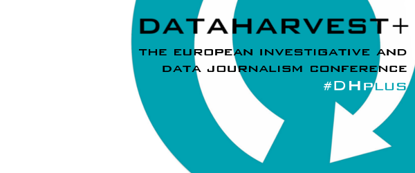

[journalismfund.eu](http://journalismfund.eu/) is organising the fourth edition of the [Dataharvest+](http://journalismfund.eu/event/dataharvest-european-investigative-and-data-journalism-conference-brussels) conference next week. Investigative journalists, data specialists and coding whizzkids will once again gather in Brussels on Friday 9, Saturday 10 and Sunday morning 11 May 2014. The conference is the way to get up-to-speed about new research methods, bounce story ideas off experienced colleagues, get help from expert data analysts for your investigation and find out about cutting-edge ways to present your story. But what’s even more interesting is the day before, the hackathon.

journalismfund.eu is, together with OKFN, inviting developers and data journalists to come to the conference site on thursday the 8th of May for a Datajournalism Hackathon. They will spend a day digging deep into the EU’s data.

In a hands-on event addressed at both coders and journalists, you’ll be able to work in small teams to extract fresh data from EU institutions, make visualisations and find stories worth telling. In the run-up to the EU elections later in the month, you’ll work on two topic streams:

**1) EU public contracts: Where does the money go?**

Starting in January 2014, the EU Publications Office has finally made available a machine-readable copy of the EU Tenders Electronic Daily (TED) database. This database contains information on the procurement processes of EU institutions, but also all major contracts from each of the member states.

For many of the contained contracts, we find the beneficiary and the contract amount – great data for journalists to look into what public bodies are buying, who they purchase it from and if they’re paying a good price.

As the TED database is fairly large and complex, the best way to mine it is through collaboration between coders and journalists – so Dataharvest gives you a unique opportunity to understand where public contracts money in the EU goes.

**2) EU election freestyle**

Two weeks ahead of the EU parliament elections, there will be many questions to answer: will Europe see the rise of right-wing extremist parties in the parliament? What policies do the candidates actually propose? Who will be part of the new commission?

The EU election challenge will not mandate a dataset; that’s why during the hackathon we will rather work together with the participants to generate stories and graphics relevant to the upcoming election. The organisers will also share their resources to make sure that everyone has the right data and tools to do good results reporting.

If you’re still not convinced, take a look at http://ted.openspending.org/ and review the datasets that will explored throughout the hackathon.

**Some practical info**

Date &amp; time:  
Thursday the 8th of May 2014, the hackathon start at 10:00 and will go on until the evening.

Registration:  
Please register on the [journalismfund website](http://www.journalismfund.eu/dhplus/register), that way you’ll be on the list of participants and the mailinglist for more updates. You might notice that there is a fee for the conference itself, this does not apply for the hackathon, so just send your name to administration@journalismfund.eu after your registration. That way Dataharvest+ will make a note to wave your entrance fee.

Location:  
Erasmushogeschool, 70 Zespenningenstraat, Brussels

Hope to see you there.
