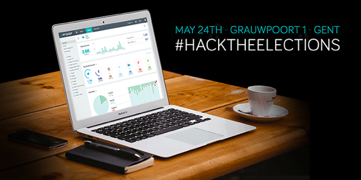

As you might know, well you should, on sunday 25th of May, everyone has to vote for the upcoming elections. With that in mind a new hackathon emerged under the name “Hack the elections” this saturday in Ghent. The organisers [Engagor](http://hacktheelections.com/), a social media management and analytics platform, will release their gathered social media data through their API so you can find the ongoing trends and create new and inspiring concepts around the elections of 2014.

During the introduction of the event, OKFN will also give a short Open Data talk about the added value of open data. Because social data and social trends are awesome, but combining them with other valuable datasets can create real value. We’ll also try to provide an overview of the different open election datasets in a blogpost tomorrow.

After the teams are informed they can pitch their ideas and concept, form groups and start coding. OKFN will be coaching and helping the teams to deliver a great demo. So if you’re joining us this saturday and you have questions about open data use, feel free to talk to us about it.

**What’s the goal?** Engagor has three wishes or ideas:

- Predict who will win the elections based on social media buzz?
- Build a really cool dashboard for real-time analytics the day of the elections?
- Come up with another great hack for the elections?

We would love it when someone could make an interesting link between what has been said and promised on social media and what has already been done so far through the use of open data. Do you have an idea how to link social data to open data? Feel free to let us know.

**What’s in it for you.**  
This hackathon is a good opportunity to work with interesting data, prove your skill set, learn lots of new things, and get to know some fresh faces in the Belgian developer scene! And if you aren’t convinced yet: there are some pretty cool prices to win as well!

If you don’t want to compete in this Hackathon, but you would love to attend the tech talks and project demonstrations, no problem. You can just sign up as a demo visitor, and join us at 18:30! Engagor will invite Nils De Moor to talk about [Redis](http://redis.io/), a Memcache on Steroids. Stijn Beauprez on the other hand will talk about [Vk14Bingo.be](http://vk14-bingo.be/) and its technical aspects.

**Practical info**  
Program May 24th  
08:30 – Welcome &amp; Breakfast

09:00 – Introduction about the planning and use of the Engagor API

09:30 – Pitch your idea

10:00 – Form teams and start coding

13:00 – Lunch

14:00 – Coaches help teams

18:30 – Tech talk

19:30 – Demo time: the participants show off the cool things they created

20:30 – Prizes &amp; Networking

**Location**

Hosted at the Engagor offices: Grauwpoort 1, 9000 Gent.

**Where do I sign up?**

Just go to <http://hacktheelections.com/> and we’ll see you on saturday.  

