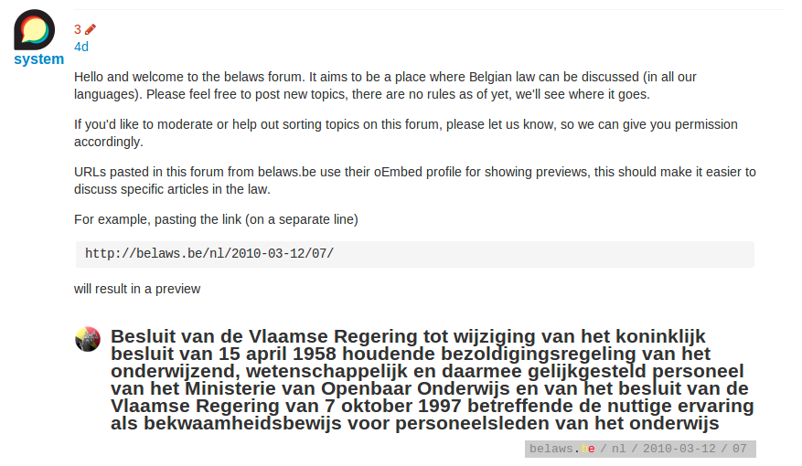

Tim Esselens has launched [BeLaws](http://belaws.be) back in 2011. It is a search interface on top of all the laws in Belgium.

We have done some maintenance on the server and have added a new feature: the forums. On the forums you can ‘cite’ a law (which will be previewed within the text) and you can discuss it with fellow BeLaw-ers.

Hope you like it and I hope we will see you on the forums!

Pieter
