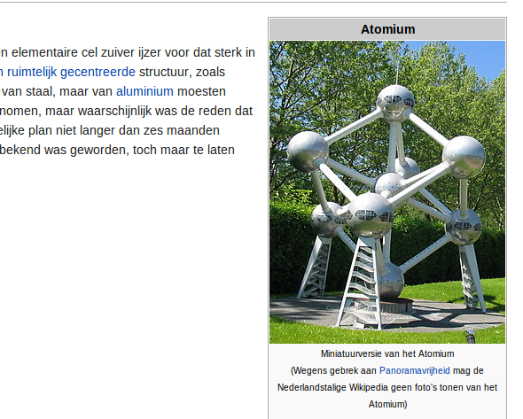

So you have created a nice picture of a panorama in Belgium? Think twice before you share it. Copyright legislation in Belgium doesn’t allow you to share the picture: there is no freedom of panorama. This is why amongst others, if you look at the wikipedia page of the atomium, you will see a picture of the miniature version, not of the real thing.

Is this absurd? Obviously it is. Neelie Kroes however is calling for copyright reform and we wish to support this.

The atomium on Wikipedia

On social media, our friends of Creative Commons Belgium have opened the discussion: \[[View the story “Atomium &amp; Freedom of Panorama” on Storify](//storify.com/dimi_z/atomium-and-freedom-of-panorama)\]
