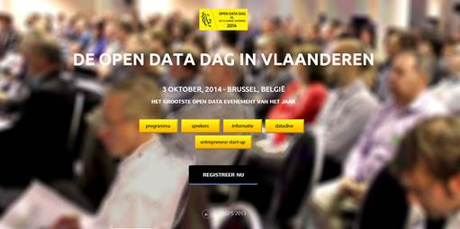

Elk jaar organiseert de Vlaamse overheid de “[Open Data Dag in Vlaanderen](http://www.opendatadag.be/)”. Meer dan 500 deelnemers uit binnen- en buitenland hebben de eerste en tweede editie van dit Open Data evenement bijgewoond.

[Dit jaar is de gebruiker van Open Data aan het woord](http://opendatadag.be/index.php/informatie); bedrijven, organisaties, ontwikkelaars en individuen die met Open Data aan de slag gaan. Entrepreneurs en anderen die met deze data en informatie applicaties en web toepassingen bouwen die op hun beurt economische en sociale meerwaarde creëren.

Nationale- en internationale CEO’s, CIO’s en projectmanagers krijgen op deze Open Data Dag in Vlaanderen de gelegenheid hun projecten en applicaties in de schijnwerper te zetten. Zij zullen ons ook vertellen wat hun verwachtingen en aanbevelingen zijn met betrekking tot het Open Databeleid en de beschikbare data feeds, welke nieuwe klemtonen de aanbodzijde moet leggen en waar data-eigenaars verder aandacht moeten aan besteden.

Er is meer. Op deze Open Data Dag in Vlaanderen krijgen data-eigenaars (de entiteiten bij de Vlaamse overheid en de lokale overheid) en data-gebruikers (geïnteresseerde ontwikkelaars, bedrijven, organisaties en designers), tijdens een “[Datadive](http://opendatadag.be/index.php/news)”, de gelegenheid, in een constructieve dialoog, samen het aanbod en gebruik van die data op elkaar af te stemmen. Er wordt onderzocht wat de behoeften en wensen zijn van de data-gebruiker, op welke wijze data-eigenaars hierop kunnen inspelen, welke projecten er al op stapel staan en op welke wijze deze dialoog verder kunnen continueren.

Ook op 3 oktober, tijdens deze Open Data Dag in Vlaanderen, wordt er een [workshop](http://opendatadag.be/index.php/news/entrepreneur-start-up) georganiseerd voor ondernemende mensen van kleine en grote bedrijven, maatschappelijke organisaties, kennisinstellingen en overheden, dus voor ondernemers die van een open data idee een concept willen maken, maar ook ondernemers van een bestaande toepassing een open data dienst willen maken.

Kortom, het wordt een bijzonder interessante dag voor iedereen die op welke wijze ook al betrokken mag zijn bij het Open Data gebeuren. Wees er bij, [bekijk het volledige programma](http://opendatadag.be/index.php/events) en [registreer alvast hier..](http://opendatadag.be/index.php/open-data-in-vlaanderen-registratieformulier)
