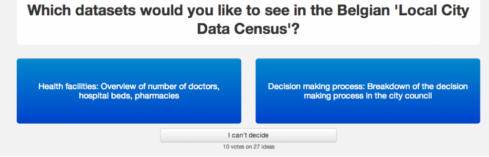
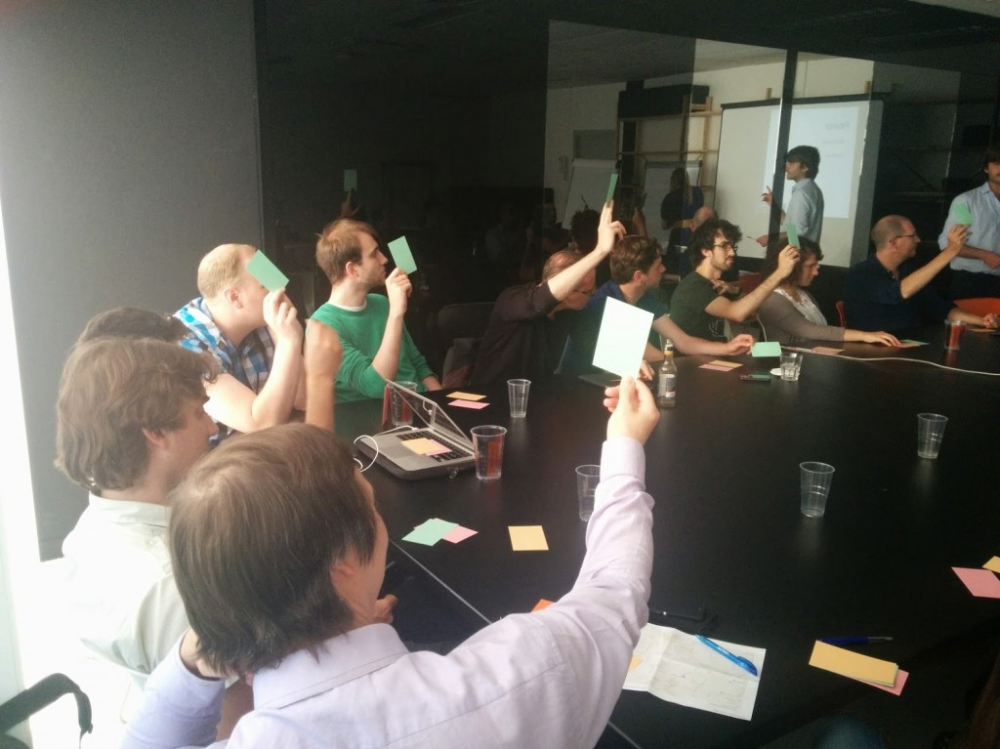

Open Belgium has been carefully planning the release of a **Local Open Data Census**, which is a benchmark, similar to the [National Open Data Census](http://national.census.okfn.org/), as a way to measure local Open Data efforts. The goal is to acknowledge Open Data efforts of Belgian local governments who already have a lot of datasets online and to motivate those who are considering Open Data as well. Which Open Datasets we’ll use as a benchmark for this ranking is entirely up to all of you!

##### Go to the [Allourideas survey](http://www.allourideas.org/localdatacensus-be) and choose which of the two proposed datasets seems the most interesting to you. If neither of them sounds good, just add your own dataset with a short explanation. The more you vote between two datasets and add new datasets, the more enriched data we have to make this a good census.

The objective is to have 10 to 15 datasets to rank the local governments [on this page](http://be-city.census.okfn.org/). The survey runs for three weeks, which means we’ll stop the survey on friday the 12th september at noon. So start voting and suggesting!

#### A little background

OKFN central released the local city data census earlier this year in order to rank local governments within a certain country on their Open Data efforts. Excited as we were, we immediately asked if we could moderate this ranking for Belgium. The only thing was that the standard datasets, which you can still view on the [local data census template,](http://be-city.census.okfn.org/) are not always applicable to the local governments in Belgium. For example, air quality is something that is measured on a regional level in Belgium, not on a local one. So you can’t motivate cities to open up these datasets, because they don’t own them in the first place.

That’s why decided to change the datasets by the power of the crowd: The Belgian citizens and open data enthusiasts. In order to start up the local data census we want involve as many people as possible in this 3 part process. Three parts you say? Yes!  
We started by asking the attendees of Open Antwerp in June what they found of the standard datasets in the local data census and whether these were applicable on a Belgian local level. It was a good testing ground, seen that the room was filled with citizens, open data experts and public servants at the same time. In the end they all rejected 8 of the 15 datasets, accepted 6 and doubted about 1 of them. Even better, they suggested 20 more datasets!

#### **OK that’s 26 datasets, what now?**

That’s what we wondered as well, we didn’t want to choose ourselves between these 26 datasets and communicate that a group of plus 20 people decided on one afternoon which datasets will be used for the local data census. No we wanted to ask everyone what they think of these datasets and if we missed any of them that might be better alternatives. So that’s why we started this public survey that will take about 3 weeks. We hope this will provide us with an idea which datasets are preferred by the general audience.

After 3 weeks we’ll stop the ‘All our ideas’ survey and will submit the list of datasets and their popularity to the [Open Belgium ambassadors](http://openbelgium.be/members/). They will figure out whether the new datasets do apply on a local government level and which of the most popular datasets should be assigned to the local data census list. In order to narrow the list of datasets down to 10 to 15 they’ll take into account the popularity of a dataset, the variation of different datasets (Mix between transport, financial, health, environmental, legislative and civic information datasets) and which datasets apply to big as well as small and medium local governments.

When approved by the ambassadors, this final list will be implemented in the Belgian Local Data Census and we’ll start contacting Local City Governments and encourage them to fill in the census for their city. The local data census, just as the national one, is community based, so citizens themselves can also add datasets to their respective city.

#### A glimpse of the hopefully near future:

After the release of the local data census we want to involve the regional governments in building a regional census, which means less parties to approach, but all the more complicated, [as we work with regions and communities in Belgium](http://www.belgium.be/en/about_belgium/government/federale_staat/structure/). This would enable us to set-up an interactive webpage on OpenBelgium.be, aggregating the results from the National, Local and Regional data censuses, enabling anyone to see who is doing what concerning Open Data efforts in Belgium.

A challenge? Yes, but one we want to tackle together with the community.

 [Magazine image by aussiegall](https://www.flickr.com/people/aussiegall/)
