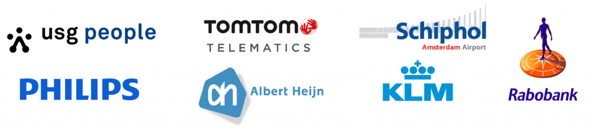
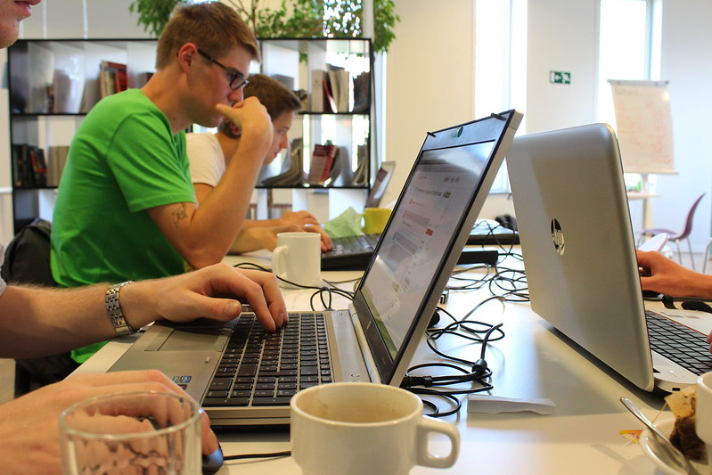

The [Dutch Open Hackathon](http://www.dutchopenhackathon.com/), the ‘iron man’ of all hackathons in the Benelux is near and it still has a 100 spaces left. This hackathon, organised by [Open State](http://openstate.eu/?lang=en) will go down in two weeks in [Amsterdam](https://nominatim.openstreetmap.org/search.php?q=Piet+Heinkade+55+Amsterdam&viewbox=-126.13%2C48.93%2C126.13%2C-48.93).

> only 100 spots left for the Dutch Open Hackathon – 20/21 september 2014 in Amsterdam – <http://t.co/jHFAKoFoRR>
>
> — Dutch Open Hackathon (@dutchhackathon) [September 3, 2014](https://twitter.com/dutchhackathon/status/507168292193452032)

### Why should you participate?

It’s big, a ‘100 spaces’ left means that around 400 hackers and developers already confirmed. Yup, that’s a hackathon of around 500 people in teams of 2 to 5 people. That will be a once in a lifetime opportunity.

### It’s a new hackathon experience

A lot of companies just opened their API for this event. This means you have a lot of options for making an application with data you don’t really have access to. Time to be creative and show what you can do by driving global innovation.

### You can make a change

Corporate and Private owned Open Data is still very scarce and this is a perfect way to convince big companies of the usefulness of Open Data and Open API’s. By showing them that Open Data should not be limited by public governments and transparency combined with co-creation within big private companies is viable option as well.

### Because Belgian hackers are not to be underestimated

[Arjan-Al-Fassed](https://twitter.com/arjanelfassed), the organiser didn’t believe me when I said the Belgian participants of hackathons are true innovators. Just to prove my point I want to get as many Belgians to Amsterdam as possible. And because our Dutch colleagues are doing amazing things regarding Open Data and Open innovation as well, it is good to meet up and hack together. Because innovation has no borders, so exchanging experience and ideas are always the way to go.

Convinced? If not, please visit the [Dutch Open Hackathon website](http://www.dutchopenhackathon.com/), they provide a lot of information about the API’s and the goal of the event.  
If you are, here is the practical information you need to get there:

[You can register for the event here. ](http://www.dutchopenhackathon.com/en/register/)

### Practical:

It’s on 20 and 21 september 2014  
It’s a 30-hour Hackathon  
It’s at the IJtoren Amsterdam, Piet Heinkade 55 in Amsterdam

### Programme

**Saturday**  
09.00 Participant registration  
10.00 Welcome – start hackathon  
12.00 Lunch  
20.00 Walking dinner + speaker  
22.00 Night activity  
00.00 … all nighter…

**Sunday**  
08.00 Breakfast  
12.00 Sub jury pitching (90 seconds video + Q&amp;A session)  
14.00 All 90-second videos are shown on screen on main stage  
15.00 Top 10 pitching for jury on main stage  
16.00 Award ceremony  
17.00 End

**Contact:** Open State Foundation  
Arjan El Fassed  
Tel: +31 (0)20-308-0567 / +31 (0)6-21703833

If you are heading to Amsterdam in two weeks, let us know! We’ll be rooting for all the Belgian teams.
