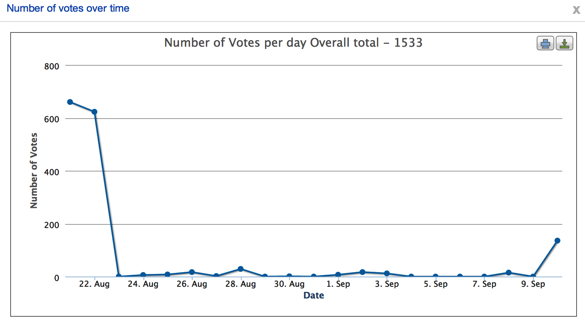
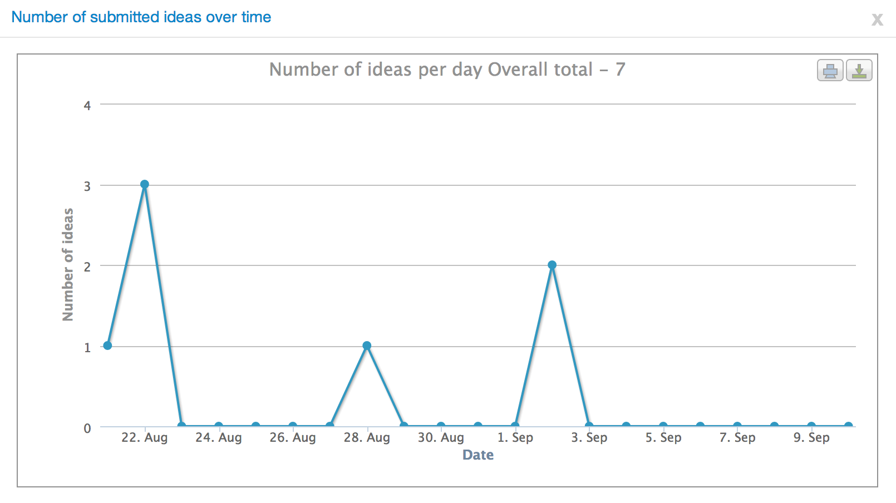
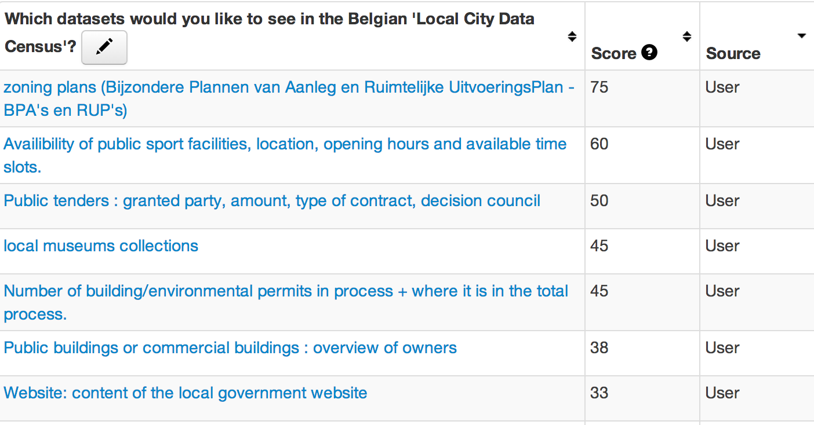
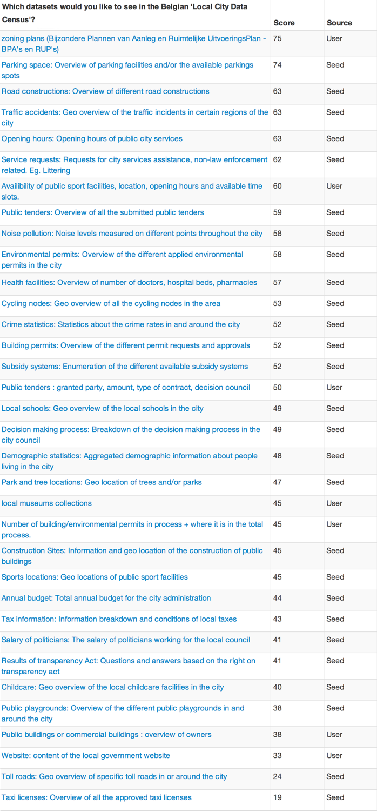

After launching our [Public Consultation Call](http://openbelgium.be/2014/08/choose-local-open-data-with-us/) three weeks ago we have received 1533 votes on our All Our Ideas page Wiki Survey. Thank you for your contributions to this inquiry. We’ll talk about the results of these votes and how we’re going to approach choosing the 10 to 15 winning datasets to be used in the actual Belgian Local Data Census.

In the end of June, before we started this public consultation we had a meet-up of Open Belgium ambassadors, local public servants and citizens around the idea of building a Local Data Census during [Open Antwerp](http://www.eventbrite.nl/e/open-antwerp-registration-11919219707). [Maaike Scherrens](https://twitter.com/maaikescherrens) and [Mathias Van Compernolle](https://twitter.com/mvcomper) introduced the participants to the 15 standard datasets that are now on a still empty [Local Data Census webpage](http://be-city.census.okfn.org/). 8 were refused, 1 abstained and 6 were approved, although some proposed to split these up into multiple smaller datasets.

##### Here are the 6 approved standard datasets:

- Annual budget: Total annual budget for the city administration
- Public Facilities (split over multiple subjects)
- Crime statistics: Statistics about the crime rates in and around the city
- Public tenders: Overview of all the submitted public tenders
- Building permits: Overview of the different permit requests and approvals
- Service requests: Requests for city services assistance, non-law enforcement related. Eg. Littering

What we were very grateful about during the Open Antwerp session, was that a lot more datasets were suggested. In merely an hour and a half the participants suggested 22 possible datasets, which together with the 6 displayed above formed the base for the Public Consultation on the Wiki Survey.

##### Here are the 22 suggested datasets:

- Parking space: Overview of parking facilities and/or the available parkings spots
- Road constructions: Overview of different road constructions
- Traffic accidents: Geo overview of the traffic incidents in certain regions of the city
- Opening hours: Opening hours of public city services
- Noise pollution: Noise levels measured on different points throughout the city
- Environmental permits: Overview of the different applied environmental permits in the city
- Health facilities: Overview of number of doctors, hospital beds, pharmacies
- Cycling nodes: Geo overview of all the cycling nodes in the area
- Subsidy systems: Enumeration of the different available subsidy systems
- Local schools: Geo overview of the local schools in the city
- Decision making process: Breakdown of the decision making process in the city council
- Demographic statistics: Aggregated demographic information about people living in the city
- Park and tree locations: Geo location of trees and/or parks
- Construction Sites: Information and geo location of the construction of public buildings
- Sports locations: Geo locations of public sport facilities
- Tax information: Information breakdown and conditions of local taxes
- Salary of politicians: The salary of politicians working for the local council
- Results of transparency Act: Questions and answers based on the right on transparency act
- Childcare: Geo overview of the local childcare facilities in the city
- Public playgrounds: Overview of the different public playgrounds in and around the city
- Toll roads: Geo overview of specific toll roads in or around the city
- Taxi licenses: Overview of all the approved taxi licenses

So even before the Public Consultation started, we had more datasets than there should be on the Local Data Census. It is recommended to have around 10 to maximum 17 datasets. But we really wanted to break the conversation open to everyone in Belgium and not just determine our choices on one workshop. So we decided to host a live Wiki Survey that would run for three weeks. Most of those votes were given in the first few days:

But we’re glad that we did suggest to do it over three weeks, because the new ideas coming in were spread out during the whole period.

##### In total the crowd added 7 new ideas:

- Website: content of the local government website
- Public buildings or commercial buildings : overview of owners
- Number of building/environmental permits in process + where it is in the total process.
- Local museum collections
- Public tenders : granted party, amount, type of contract, decision council
- Availability of public sport facilities, location, opening hours and available time slots.
- Zoning plans (Bijzondere Plannen van Aanleg en Ruimtelijke UitvoeringsPlan – BPA’s en RUP’s)

So in the end we had no less than 35 different datasets, or at least variations. And a few of the crowd suggested datasets during the Wiki Survey actually made it quite high in the overall ranking.

### Rough results of the Wiki Survey

If you want to look into the raw data of the survey, you can[ find it here as comma seperated csv files](https://www.dropbox.com/sh/zpa4a660s71sia1/AADA0kaBRllER5lPHCEb7Qk9a?dl=0).  
Below we added the full results list, based on the score given by the [Wiki Survey tool](http://allourideas.org/).  
Do take note that this ranking is based on the number of positive votes, not total votes. So ideas that were brought up later, but had a lots of positive votes will have a much higher score than datasets which have many more positive votes, but also had a few downvotes along the way.

### So what are the final steps after this public consultation?

This dataset list and current ranking will be presented to our [Open Belgium Ambassadors](http://openbelgium.be/members/) to assess and discuss a few things. This will be crucial to determine which of the datasets we will keep. The following questions still need to be answered:

- If all the suggested datasets are applicable on a local level or does it contain datasets that are only available on other levels such as regional or federal or within other organisations such as utility companies.
- If these datasets are applicable for every local government from big cities to smaller towns.
- If we have a balanced mix of datasets. In the Open Antwerp session there were [6 topics suggested](http://www.slideshare.net/OpenKnowledgeBE/localdatacensus): Transport, finance, health, environment, legislative and civic information. Can we ensure a balance between these different topics?
- Considering all of the above, which 15 datasets will fit the best in the spirit of the Local Data Census: Creating awareness in local governments and stimulating opening up datasets for its citizens.

After this final decision making part we’ll have a list of datasets that will actually be implemented in the Local Open Data Census. We’ll add definitions and a how-to so that anyone can start adding datasets of their city. When the platform is ready, we’ll release a blog about it on the Open Belgium website, start contacting local goverments to implement their efforts and have a workshop during the Open Belgium Confere in Namur in February 2015. So we are getting closer to a final result, which will probably be around the end of October or early November.

Thank you everyone again for your patience and your input on this census. It’s good to see that this Local Data Census will eventually be a crowdsourced product that is specifically designed for cities in Belgium.  
If you have further questions on this project, feel free to let us know in the comments below.
