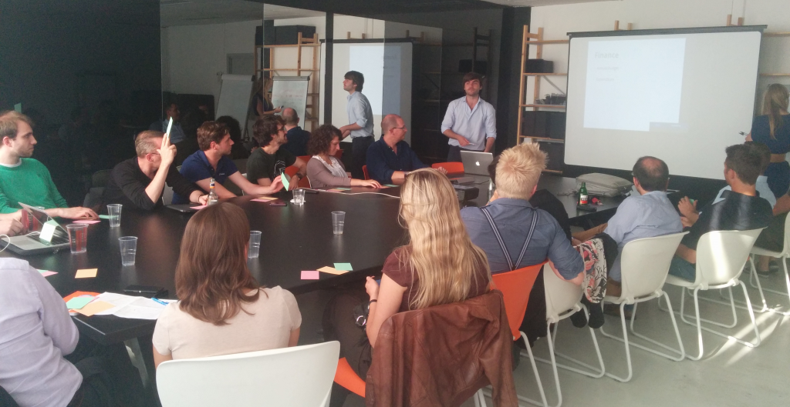
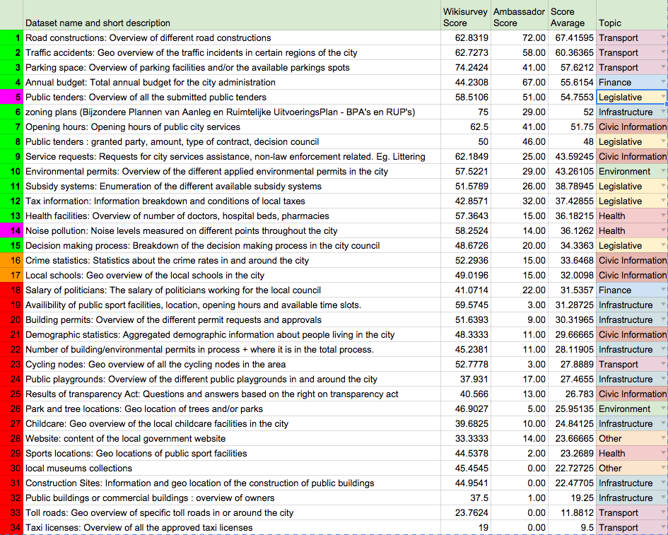

After a first live discussion, a fruitful [public consultation](http://openbelgium.be/2014/09/results-of-wiki-survey-and-final-steps/) and close cooperation with our Open Belgium ambassadors we have what could be the 15 datasets used for the local data census. But before we implement this top 15, we want your final approval or objection if you do not agree.  For those who are not familiar with the whole process:

- We started by collecting proposed datasets and discussing the [standard datasets](http://be-city.census.okfn.org/) during the Open Antwerp workshop in [June](http://www.eventbrite.nl/e/open-antwerp-registration-11919219707?aff=eorg).
- We did a public consultation, asking everyone to rank these datasets through a wiki survey and add new ones as well. You can see the results in [this blogpost](http://openbelgium.be/2014/09/results-of-wiki-survey-and-final-steps/).
- We asked our [Open Belgium ambassadors](http://openbelgium.be/members/) to give us their top 15 datasets for the local data census, taking into account the score of the wiki survey.
- Finally we combined the scores of the wiki survey with the scores based on the top 15 of our Open Belgium Ambassadors.

This provided the following ranking: 

Yesterday, during a final online meeting with the Open Belgium ambassadors we asked them whether this top 15 was balanced enough to publish on the Local Data Census. We wanted a lists of datasets that can be opened by almost every city or municipality, regardless of size of population. We also wanted a balance between datasets which are easy to obtain and open up and datasets that are hard to obtain on a practical and a political level.

In the end we changed two datasets in the ranking in order to have a balanced top 15. What we eventually left out:

**Number 5 Public Tenders**

Simply because the dataset Public Tenders can be found twice in the top 15 ranking as displayed above and we felt that Public Tenders dataset number 8. has far more interesting requirements than 5. So we chose 8. to stay and replace 5. with the number 16. in the ranking Crime Statistics.

**Number 14 Noise Pollution**

Although Noise pollution is a very interesting dataset, it is not a dataset that every city or municipality can obtain because it requires expensive recording equipment, especially if you want real time data. So we decided to replace it with a more feasible option: Local Schools which is number 17 in the total ranking.

So that means the 15 datasets of the Local Data Census Belgium are:

1. _Road constructions: Overview of different road constructions_
2. _Traffic accidents: Geo overview of the traffic incidents in certain regions of the city_
3. _Parking space: Overview of parking facilities and/or the available parkings spots_
4. _Annual budget: Total annual budget for the city administration_
5. _Zoning plans (Bijzondere Plannen van Aanleg en Ruimtelijke UitvoeringsPlan – BPA’s en RUP’s)_
6. _Opening hours: Opening hours of public city services_
7. _Public tenders : granted party, amount, type of contract, decision council_
8. _Service requests: Requests for city services assistance, non-law enforcement related. Eg. Littering_
9. _Environmental permits: Overview of the different applied environmental permits in the city_
10. _Subsidy systems: Enumeration of the different available subsidy systems_
11. _Tax information: Information breakdown and conditions of local taxes_
12. _Health facilities: Overview of number of doctors, hospital beds, pharmacies_
13. _Decision making process: Breakdown of the decision making process in the city council_
14. _Crime statistics: Statistics about the crime rates in and around the city_
15. _Local schools: Geo overview of the local schools in the city_

Is this list of datasets something you approve? If not, please let us know why and what suggestions you have by sending an email to pieterjan \[at\] okfn.be. I’ll send the email to the Open Belgium ambassadors with the inquirer in CC.So please do let us know if you think there could be a more suitable top 15.

If we do not receive any feedback after the 16th of October we’ll assume this list is approved.

**Choosing the cities**  
What we also discussed is which cities we will include in the Local Data Census at first, because adding all 589 municipalities and cities would be an overload to manage. So we decided to base ourselves on the 50 cities with the biggest population in Belgium, found in this list: [http://nl.wikipedia.org/wiki/Tabel_van_Belgische_gemeenten](http://nl.wikipedia.org/wiki/Tabel_van_Belgische_gemeenten). However municipalities who are not in this top 50 can be added to the list upon request.

**Next Steps**

After the approval process we need to write proper definitions for each dataset, publish the list and definitions on <http://be-city.census.okfn.org/> and start incentivising cities and open data hackers to add the datasets of their respective municipality.

If you want to help out with the definitions or the dissemination of the census or the adding of datasets, let us know and we’ll keep you posted.

Headerimage CC-BY J.D. Hancock – [Flickr](https://www.flickr.com/photos/jdhancock/)
