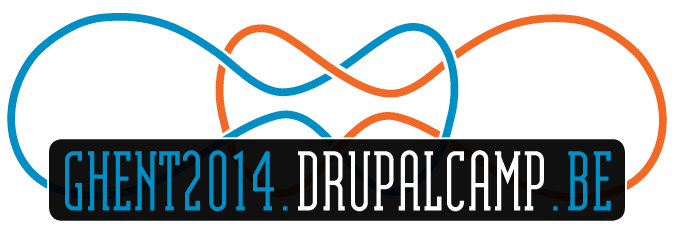

Have you participated in an hackathon this year? And are you ready to build a start up around your application? Or are you still tweaking your open data application idea and do you consider turning that idea into a viable start-up? If your app is using Open Data as a resource than we have the perfect opportunity for you.

At [Apps for Europe](http://www.appsforeurope.eu/competition) we want to connect the best Open Data applications to a crowd of European investors, incubators and accelerators. But to be allowed to participate during the international business lounge at [Future Everything festival](http://futureeverything.org/festival/), you need to prove your application is worth the attention. That’s why we want to help out with a few thorough preparation sessions:

On saturday the 8th of November we’re organising a pre-business lounge in Ghent. This pre-business lounge will go down during [Drupalcamp 2014 in Ghent](http://ghent2014.drupalcamp.be/) on the ‘Schoonmeersen Campus’ of HoGent. During the camp we will give a introduction session on ‘[Making money with Open Data](http://ghent2014.drupalcamp.be/sessions/making-money-open-data)’, where we discuss open data business models and examples of succesful implementations. Afterwards there is a [‘how-to-pitch’ session](http://ghent2014.drupalcamp.be/apps-4-europe-business-lounge) in the afternoon with live try-outs where other participants are your soundboard, enabling you to tweak your business pitch perfectly. So on one day you will learn to write the ideal Open Data business pitch. Interested? Let us know you’re coming through <pieterjan@okfn.be> and register on <http://ghent2014.drupalcamp.be/> (it’s free!)

**Next Steps**  
After the pre-business lounge you will be ready to pitch your application to the whole of Europe. But to be a finalist for the international business lounge in Manchester during Future Everything Festival you need to prove yourself. This can be done in two separate ways.

1\. [You submit your application online on the Apps for Europe website.](http://www.appsforeurope.eu/content/submit-your-application) A grand jury of experts will decide which application will go through to the international business lounge.

2\. You can attend one of the local business lounges. The winner of each local business lounge also gets a direct ticket to the final international business lounge.

_Tip: You can enter the online competition and participate in the local business lounge with the samen application._

For Belgium, the local Business Lounge will be on the 3rd of December during the [Opening-Up Conference](http://www.opening-up.eu/content/final-conference). There you will be able to give a 5 minute pitch to a jury of 5 accelerators / incubators, open data experts and start ups. Convince them of your application and win the local business lounge, which is also good practice for the international business lounge. If you want to join us as a contestant, send a mail to pieterjan@okfn.be. It’s not obligatory to have attended the pre-business lounge to enter the local business lounge, but it recommended for early stage open data ideas or people who are new to pitching their idea.

And if we can’t convince you, maybe Nigel Williams can.

So come to the local business lounge or pre-business lounge to promote or build upon your open data idea or application. If you have questions about the business lounge or the online competition, <a>let us know</a> and we will be happy to answer them.
