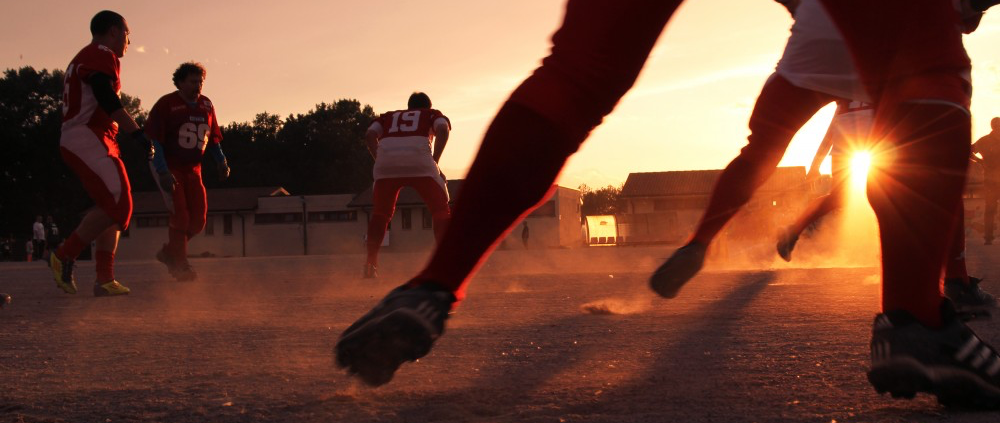

#### Create the ideal application to inspire those around you to exercise and keep fit.

Move Kortrijk is a hackathon that will revolutionise how people do sports or exercise to keep fit. But only if you can complete this challenge: How can we stimulate citizens to participate in sport activities or how can we motivate free sporters to do attend other sporting events. Do you think you can solve this with an application? Then this is your perfect hackathon.

This hackathon in Kortrijk is ideal for small teams of software developers and designers to work on their dream application.  
It can be a native application for smartphones and tablets or a web application, but in 24 hours we want to see a solid proof of concept that involves sports or exercising. Convince the jury and they see how they can support you with the further development of your application.

Move Kortrijk is organised by the City of Kortrijk, Sportplus and University-College Vives.

**Program**  
Move Kortrijk start at **friday the 14th of november at 14:00** and ends on 15th of november at 12:00 (noon). This will all go down at the University College campus of Vives, Doorniksesteenweg 145 in Kortrijk (entrance through the steenbakkerstraat – building of ‘handelswetenschappen en bedrijfskunde’.

During the event participants can receive strategic and technical support from coaches to make a great application.  
Around 12:00 the jury will deliberate and see which teams will receive a reward.

**Entry**  
Entry is free, but registrations are mandatory. [Register here for the hackathon.](http://www.kortrijk.be/formulieren/inschrijven-voor-move-kortrijk)

It’s not necessary to have a team during your registration. You can forms team on the day itself. Visitors don’t need to register.

May the best team win!
