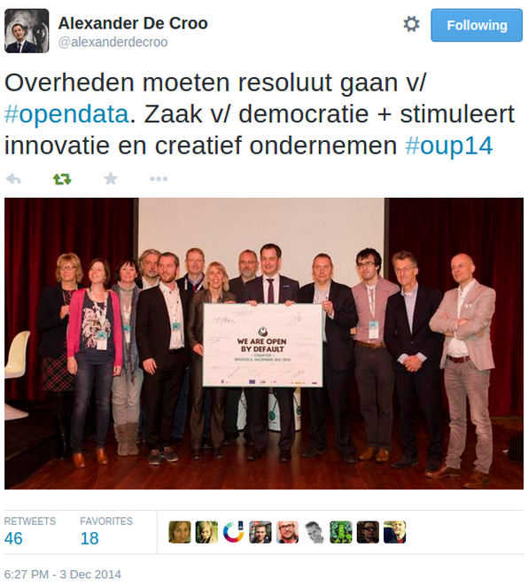

**According to the Global Open Data Index, Belgium ranks 53d out of 97 countries, going up from 27% to 39%. A status quo one might think, knowing that last year Belgium ranked 58th, but a lot has happened since.**  
The Global Data Index, a tool developed by Open Knowledge, ranks 97 nations based on 10 key national datasets. The UK sits at the top with 96% opened up data on government spending, budget, postal codes and more. Belgium however remains in the middle of the list between Croatia and Costa Rica.

Yet a lot has changed: [KBO/BCE](http://datanews.knack.be/ict/nieuws/kbo-wordt-open-data-op-9-mei/article-normal-295713.html) opened up their company register database as open data \[1\] earlier this year and [Irceline](http://www.irceline.be/) launched the pollutant emissions website \[2\] opening up data on air quality. Detailed results can be found at <http://index.okfn.org/place/belgium/>. “If nothing happened regarding opening up Belgian data, we would have dropped to the 83rd place. Opening up data is a global phenomenon, it is not happening only in the Western countries”, says Pieter-Jan Pauwels, community coordinator at Open Knowledge Belgium.

<iframe frameborder="0" height="508px" src="http://index.okfn.org/vis/map/embed?embed_height=508px&embed_title=All%2520datasets%2520%3B%25202014&panel_tools=false&map_place=" width="100%"></iframe>

That is something the new federal government realised, especially when neighbouring countries take on the 1st (UK), 3rd (France), 9th (Germany) and 16th place (Netherlands). In the [new federal policy agreement](http://www.premier.be/sites/default/files/articles/Accord_de_Gouvernement_-_Regeerakkoord.pdf), open data was mentioned several times and where once nobody was directly responsible we now have a minister responsible for the Digital Agenda. Minister Alexander De Croo announced last week at the [Opening Up conference](http://www.opening-up.eu) that this number is too low and will be higher next year. Together with organisations such as [Leiedal](http://leiedal.be) and [Open Knowledge Belgium](http://okfn.be), he signed the “Open by default” charter, where Belgium now promises to open up datasets if there are no good reasons not to.

The 23d of February Open Knowledge Belgium vzw/asbl will organise the [Open Belgium conference in Namur](http://2015.openbelgium.be/) with minister De Croo as one of the keynote speakers. During the conference we will discuss open data on different levels in Belgium as well as host hands-on sessions on e.g., open science, open tourism, open transport or open street map. The full programme is available at <http://2015.openbelgium.be>.
