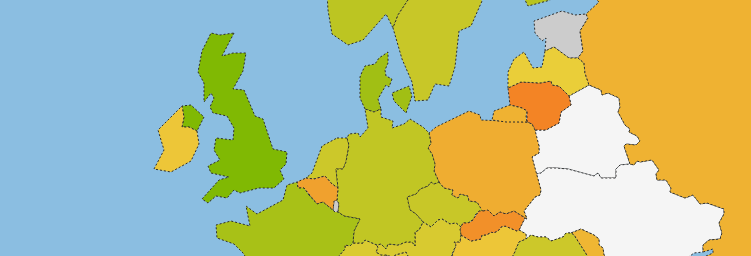

In our article on the [9th of December](http://okfn.be/2014/12/09/belgium-scores-slightly-higher-on-the-global-open-data-index-big-expectations-for-2015/) we’ve talked about Belgium scoring slightly higher on the Global Open Data Index. We went from 58th to 53rd. And even though we have positive aspirations for 2015 because we now have a federal minister of the Digital Agenda who is directly responsible for Open Data and multiple mentions in the policy agreement. We did get a few questions and remarks on our results:

_Why is Belgium so low in relation to it’s neighbouring countries? Every [Western European](http://t.co/EDpfLkjQ7a) country sits at the top._

_How can a country with an established [local Open Knowledge Chapter](http://okfn.be/) and projects like [iRail](https://irail.be/route) still rank only halfway the index?_

To sum it up, we were asked the question: Why does Belgium rank so low?

The Twitter-conversation with Phil Archer from W3C and Pieter Colpaert sums up our anwser in only a few tweets:

> .[@openbelgium](https://twitter.com/openbelgium) [@pietercolpaert](https://twitter.com/pietercolpaert) Is Wallonia and/or Brussels dragging you down? 53rd doesn’t feel right to me knowing [@opendataforum\_](https://twitter.com/opendataforum_)
>
> — Phil Archer (@philarcher1) [December 9, 2014](https://twitter.com/philarcher1/status/542364745110937600)

> [@philarcher1](https://twitter.com/philarcher1) [@opendataforum\_](https://twitter.com/opendataforum_) A lot of national datasets are not [\#opendata](https://twitter.com/hashtag/opendata?src=hash). If we’d have a census for regions, Flanders would score way ↑
>
> — Pieter Colpaert (@pietercolpaert) [December 9, 2014](https://twitter.com/pietercolpaert/status/542365214558416896)

But don’t get us wrong, the [Global Data Index](http://index.okfn.org/) is a great tool to benchmark countries on their national open data efforts. And to have a relative simple tool for the open community to crowdsource a global ranking you need to make certain choices. But that doesn’t mean that Belgium is doing a bad job. Open Data in Belgium and broader open knowledge is mostly emerging from bottom up initiatives by numerous organisations and local/regional governments.

Cities like [Ghent](http://data.gent.be/), [Antwerp](http://opendata.antwerpen.be/) and [Kortrijk](http://www.kortrijk.be/opendata/data) are pushing the local envelope by organising hackathons and datadives for their citizens. But that’s not part of global index.

[Open Data Forum](http://www.opendataforum.info/) has proven that there is public support in all layers of the Flemish government and associated organisations for opening up data, they support local initiatives and show best practices on a federal level. And a packed data portal. But that’s not part of the index.

[AWT](http://www.awt.be/) is putting similar efforts in motion in Wallonia together with the Hackathon [e-Gov Wallonia](http://hackathonegovwallonia.net/) team who just organised the first [Brussels hackathon](http://www.transformabxl.be/agenda/event/hackathon-open-data-brussels) as well. Still not a part of the index.

The brilliant researchers at [iMinds](http://www.iminds.be/), the research groups and the different universities have helped us tremendously on a strategical / scientific level as well in supporting a lot of our causes and activities. Not part of the index.

And [iRail](https://irail.be/route). Well… They open up national transport data in Belgium through their API for 3rd parties, but iRail is not an official source. So you guessed it, not applicable for the index.

To make a long story short. Belgium is not doing a bad job concerning open data. There is still a lot to be done, but there are a lot of efforts and little victories that you don’t see in the Global Data Index. And those efforts and victories are not just a result made possible by Open Knowledge Belgium. No, we are just a part of a bigger network of organisations, ambassadors and projects of which I have probably forgot to mention a lot of.

I’m not even going to try to mention everyone that helped us to reach the point where we are now. We can only humbly say **thank you**, we hope to work with all of you in the coming years and make Belgium truly a country where everybody can benefit from open knowledge.  

Still not convinced? Feel the need to discuss this? For those people who want to discuss Open Data efforts in Belgium and get an overview on what initiatives are active today in Belgium we happily invite you to join us at the [Open Belgium Conference](http://2015.openbelgium.be/) on the 23rd February in Namur. We’ll have a panel on Open Data efforts in the different governmental layers and an overview current efforts, practical workshops on open culture, open science, open transport and business models and so much more. And we have early bird tickets until the end of this month.

