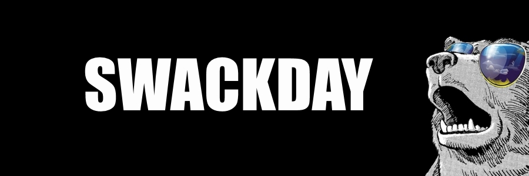

Exciting news! The 25th of April, we’ll be organising Swackday. This hackday will focus on two subjects, being oSoc15 and Apps for Ghent. Everyone that could be an asset for the team, can take part. To top this all off, after the hackday, we’ll have a nerdy LAN party.

**Apps for Ghent and oSoc15**

You can choose between two teams.  
The first team is the Apps for Ghent-team, they will put the finishing touches on the project from the last edition of Apps for Ghent called Project SWAG or Super Website for Apps for Ghent. Team SWAG has made a sweet branding for Apps for Ghent and an even sweeter back-end, working with October, an open-source PHP-based CMS system. These two aspects need to be finished and brought together to be put into production. Ow yes, we want this beauty to go live before Apps for Ghent VI will start. You can always take a look at our [Github repo](https://github.com/RealTeamSWAG).

The second team is #oSoc15 team. This team will co-create #oSoc15 together with Open Knowledge Belgium. There are all kinds of things to do, ranking from making designs to finishing the website to writing a new code of conduct. All of this to ensure our jubilee edition of #oSoc15 can be even more awesome. If you need some more information, you can check out [the Github](https://github.com/osoc15) and our [Trello board](https://trello.com/b/jy5QsDdM/osoc15). Even people who can’t make it to the hackday can contribute to the tasks at hand.

**How to sign up**

Just go to the [Swackday Eventbrite where you can register.](https://www.eventbrite.nl/e/tickets-swackday-16514752068)

**Practical arrangements**

Where &amp; when

- Saturday April 25, 2015
- IMinds Start-up Garage, Gaston Crommenlaan 10, 9000 Ghent
- Hacking: 10.00 a.m. until 18.00 p.m.
- The LAN party: 18.00 p.m. until 20.00 p.m.

You’ll need

- Your laptop
- Your battery charger
- All of your computer accessories you want to work with

We’ll provide

- Food
- Water &amp; coffee
- A superfun LAN party

We’re looking forward to Swackday, and to have you on board. So don’t wait any longer to [sign up](https://www.eventbrite.nl/e/tickets-swackday-16514752068). After all, you don’t want to miss out on this, now do you?
