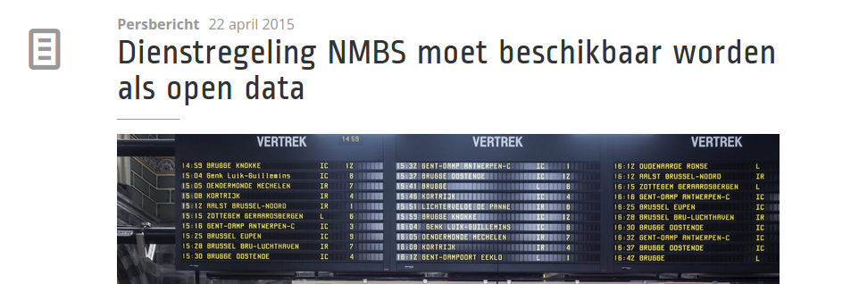

At our conference [Open Belgium 2015](http://2015.openbelgium.be), the cabinet of Theo Francken (administrative simplification) and the cabinet of Alexander De Croo (digital agenda) announced that they’re going to work together to implement the European PSI directive, and where necessary, even go _further_ than what Europe tells us to do. Today, we got the great news that **NMBS/SNCB is not going to be an exception** to the new implementation of the PSI Directive in Belgium. The minister of the Digital Agenda is urging NMBS/SNCB to open up their data in [his press release](http://decroo.belgium.be/nl/dienstregeling-nmbs-moet-beschikbaar-worden-als-open-data).

PSI stands for _Public Sector Information_. It’s a European directive (which means that member countries have to implement it, otherwise there will be a sanction) that obliges Public Sector Bodies to open up policy documents and data under [an open license](http://opendefinition.org). Of course there is a list of exceptions (the most obvious one being privacy sensitive data).

Read the PSI Directive: <http://ec.europa.eu/digital-agenda/en/european-legislation-reuse-public-sector-information>

This is great news for [open transport data in Belgium](https://hello.irail.be/2015/04/22/a-law-for-open-transport-data-in-belgium/), which supporters are probably opening up some bottles of champagne at this moment.
