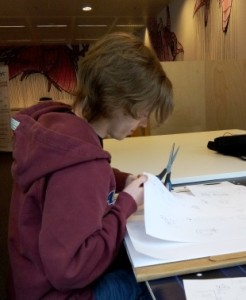
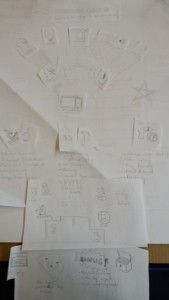

Hey,  I’m Sander and I’m the newest addition to the intern team of Open Knowledge Belgium. With me as a new recruit our intern workforce has been increased by 100%! Which means we can do at least twice as much work. I will be spending the next 8 weeks at Open Knowledge Belgium, working on various projects such as the [open Summer of code](http://2015.summerofcode.be/ 'oSoc15 website') preparations and DCAT.be.

**So who am I?**

I’m a 3rd year bachelor student in Graphical and Digital Media – Multimedia Production – ProDEV at Arteveldehogeschool, which is a mouthful, but basically means that I learn how to design and program in various environments, mostly aimed at websites or mobile applications.

I’m also an ex-oSoc-er, I spent the summer of 2014 at oSoc working on [EduCal](https://github.com/oSoc14/code9000 'EduCal'), so I have already worked with quite a few of the people of the organisation and have a rough idea of what to expect around here.

Apart from being a student and temporary minion at Open Knowledge Belgium, I’m a pretty relaxed guy. I like to hang out with my friends, play some games, be it board games or anything digital, and enjoy some good music.

**What’s my job?**

 The very first day I already got plenty of work to keep me occupied for a while. I was assigned as Lara’s minion to help her with the [oSoc15 website](http://2015.summerofcode.be/ 'oSoc15 website'), as well as make an infographic which we can send to students who would be interested. In the picture it shows me cutting and pasting the various infographic tidbits.

The next day Pieter (the big boss) showed me the other projects that could use some helping hands.

Basically I already have more potential work than I would be able to do in a mere 8 weeks. But Pieter told me that it’s important that I learn to say “No”, even to him. If I simply don’t have the time to do something, I shouldn’t accept more tasks. Because of this I have to learn how to balance my workload, and be able to estimate how much I can handle at any given time.

I had already learned a lot from the 3 weeks I spent at [\#oSoc14](http://2014.summerofcode.be/ 'oSoc14 website'), so I’m sure I’ll learn even more during my internship. I’m looking forward to all the things that are waiting for me the next few weeks.

“[The Anxious Type](https://www.flickr.com/photos/jdhancock/3562071888/in/photostream/)” by [JDHancock](https://www.flickr.com/photos/jdhancock/) is licensed under [CC BY 2.0](http://creativecommons.org/licenses/by/2.0/)
