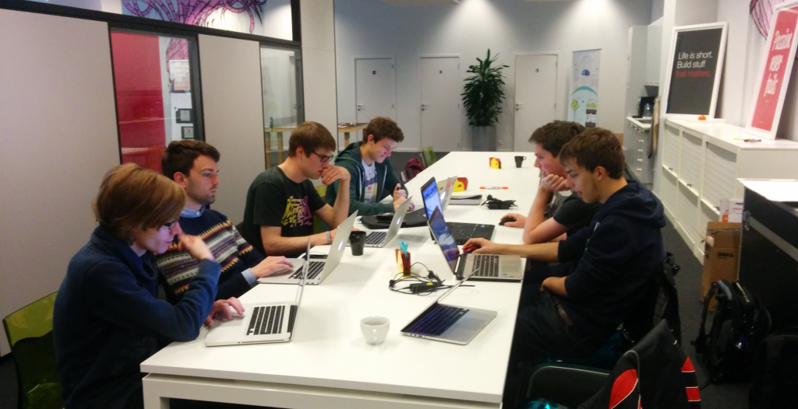
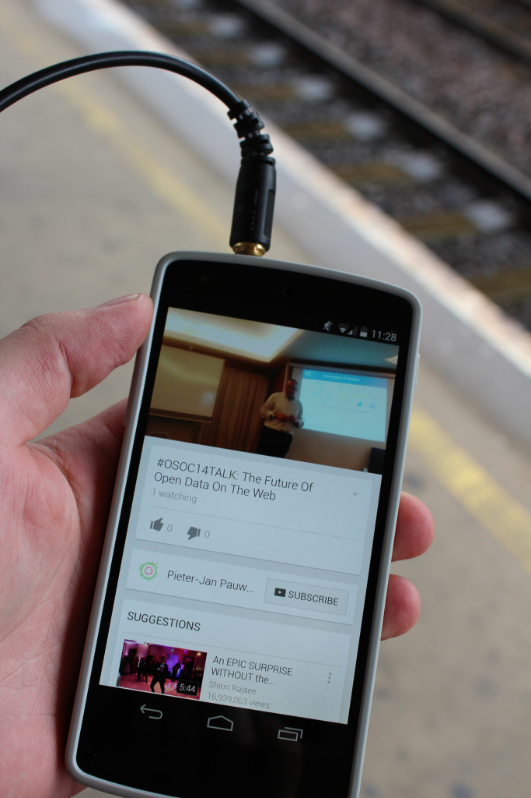

Last saturday we organised ‘SWACKday’, a hackday attended by our #oSoc14 students and a few #oSoc15 candidates (hell yeah, new blood). The focus of the hackday was on building the new version of the [Apps for X website](https://docs.google.com/presentation/d/18KvHnLEbuhrlVyNRbtPvkDPdFZlmRzFbk6oivs9nx3Q/edit#slide=id.p) as initiated by team SWAG during the [Apps for Ghent](http://appsforghent.be/) hackathon. Which ended up in mostly setting up Vagrant boxes.

Besides coding for team SWAG, we also had motivated students gathering input and thus co-creating [open Summer of code 2015](http://2015.summerofcode.be/). They did everything from (re)writing our Code of Conduct, creating an ‘[open badges](http://openbadges.org/)‘ achievement system for the students, brainstorming about which tools we should use ([Taiga.io](https://taiga.io/) ftw!), what locations and partners would be awesome AND last but not least **what speakers we should invite during the #oSoc15 lunchtalks**.

Last year we had the honour of having [Hans Verscheure](https://twitter.com/hansverscheure), e-Government manager of the City of Kortrijk, [Ruben Verborgh](https://twitter.com/RubenVerborgh), semantic researcher at MultiMedia lab and [Phil Archer](https://twitter.com/philarcher1) of W3C coming over to talk and interact with our students. This year will be no exception if one or more of these wonderful proposed speakers wants to join us for a lunchtalk.

### So we asked the students who their professional heroes and heroines were…

This is what they came up with:

**Name**  
  
Tim Berners-Lee  
  
Lea Verou  
  
Douglas Crockford  
  
Paul Irish  
  
Rachel Rayns  
  
Gabe Newell  
  
Massimo Banzi  
  
Zhong Xu  
  
Harry Roberts  
  
Wouter Smet  
  
Alexander De Croo  
  
Jeremyle Van  
  
Arne Bassez  
  
Kristof Houben  
  
Roy Van Dijk  
  
Valentijn Destoop  
  
Stephane Vanhalkman  
  
Addy Osmani  
  
Tim Van Lier  
  
Thomas Joos  
  
Michiel Akkermans  
  
Robin Wauters 

**Twitter or link**  
  
[@Timberners\_lee](https://twitter.com/timberners_lee)  
  
[@LeaVerou](https://twitter.com/LeaVerou)  
  
[GitHub Crockford](https://github.com/douglascrockford)  
  
[@paul\_irish](https://twitter.com/paul_irish)  
  
[@rachelrayns](https://twitter.com/rachelrayns)  
  
[Gabe Newell](http://www.forbes.com/profile/gabe-newell/)  
  
[@mbanzi](https://twitter.com/mbanzi)  
  
[@zhxu](https://twitter.com/zhxu)  
  
[@csswizardry](https://twitter.com/csswizardry)  
  
[@woutersmet](https://twitter.com/woutersmet)  
  
[@alexanderdecroo](https://twitter.com/alexanderdecroo)  
  
[@jeremylv](https://twitter.com/jeremylv)  
  
[@Arnebassez](https://twitter.com/Arnebassez)  
  
[@houbenkristof](https://twitter.com/houbenkristof)  
  
[@r\_oy](https://twitter.com/r_oy)  
  
[@quidante](https://twitter.com/quidante)  
  
[Roninweb on Dribble](https://dribbble.com/roninweb)  
  
[@addyosmani](https://twitter.com/addyosmani)  
  
[@vanlier](https://twitter.com/vanlier)  
  
[@thomasjoos](https://twitter.com/thomasjoos)  
  
[Michel Akkermans](https://www.clear2pay.com/about-us/michel-akkermans)  
  
[@robinwauters](https://twitter.com/robinwauters)

**Subject**  
  
Linked Open Data  
  
CSS  
  
Javascript  
  
Javascript  
  
Raspberry Pi  
  
Half Life 3  
  
Arduino  
  
Posios Story  
  
Design  
  
Growth Hacking  
  
Innovation in Belgium  
  
Sunrise story  
  
Start up  
  
Product Design  
  
Design  
  
Design  
  
Design  
  
Javascript  
  
Digital Media  
  
Innovation  
  
Start-Up BE  
  
Tech in EU 

Are you one of the speakers mentioned above and are you enthused to speak to our students during open Summer of code? We have no big budgets, but powerhouse students, fine Belgian beers and innovation flowing through our systems. We will be located somewhere in or near a Belgian city. We open up the talks to people located at our host and stream the whole thing via Google Hangout on Air for those who can’t make it. Because you know, we want to open up our knowledge.

