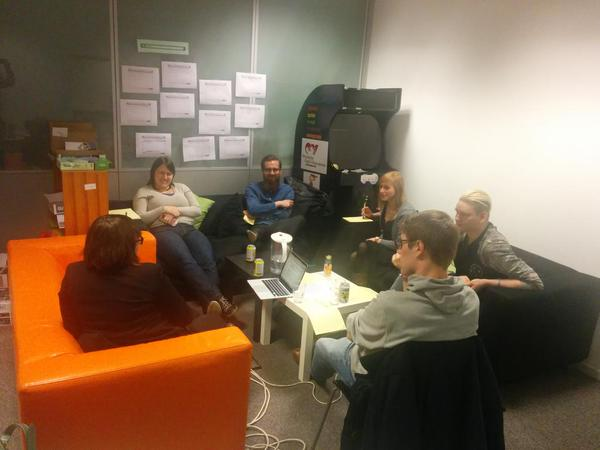

**For the past few weeks, we’ve been bombarding you with[tweets about Datawijs](https://twitter.com/search?q=datawijs). So, we thought it was time to shine some light on the [Datawijs](http://www.datawijs.be) matter. In short, our new project aims to get youngsters, age 15-25, to know more about Open Data. Not only by telling them what Open Data is about, but also by letting them experiment with it themselves, giving them the possibility to create visualisations or even apps based on Open Data. That’s why we chose to work with interactive videos, because it enables active learning in an online environment. [Want to see for yourself?](http://www.datawijs.be)**

In order to bring this to a successful conclusion, we teamed up with [Mediaraven](http://www.mediaraven.be/). We provided them with our knowledge about Open Data, they provided us with their media skills. It was clear from the beginning we wanted to work with **short-form video format**, as youngsters nowadays prefer things to be visual and brief. In our search to the ideal medium, we caught sight of the interactive video platform [Klynt](http://www.klynt.net/). This seemed perfect for Datawijs, since we’ve been wanting to engage youngsters in our videos. Klynt allows us to add links to other videos, open databases, articles, websites so we can keep our videos **up to date** at all times. We’ll also give viewers the possibility to watch the clips in the order they want, since we’ll construct the videos to be **non-lineair**. This means everyone can go their own way.

A couple ideas, a platform, some fine video expertise. We were getting close, but yet had a long way to go. What were we going to show in our videos? How could we keep our youngsters engaged? Together with a **advisory board** of several adolescents, we managed to figure that out. Our advisory board guided us towards our goal. They told us what they found interesting, what was unclear to them, what they missed in our approach. All of this to find the **right content** for Datawijs.

After we had scripted the entire content of our videos, we could start creating them. We came up with a **multilayered scheme**, having introductory videos, more in-depth ones and even a few containing tasks to fulfill. They’re about different Open Data themes. Subjects as what Open Data is, where to find it and what to do with it are dealt with. We decided to let **experts** do the talk in our in-depth videos. Filming them with a GoPro camera, combined with [typical vlog jump cuts](/www.youtube.com/watch?v=rP0MnC4FAbY&feature=youtu.be&t=10s%22), gives the videos a **vibrant look and feel**. On top of that, we were able to shoot at some unique locations, such as the Kruidtuin in Leuven and the Boekentoren of Ghent. It sure is hard to keep your feet on the ground when you’re filming at a height of 64 metres!

<iframe frameborder="0" height="450" src="https://vine.co/v/eBpqWqWEjzY/embed/postcard" width="450"></iframe>

Having everything on tape now, we’re busy editing the videos and searching for interesting content to link with our videos. In July, we’ll have Datawijs pre-screened by #oSoc15 students, in order to fine-tune the last bits and pieces. But the thing we’re the most looking forward to, is Datawijs’ grand première by the **end of October, beginning of November**. Datawijs is definitely an unique project, with an open license making it **available to everyone**. Anyone is free to do with it what they want, learn what they want, whenever they want.

Want to know more about who we’ve filmed and where?[Take a look at out ‘behind the scenes’ Storify!](https://storify.com/LaraClaire_/datawijs)
