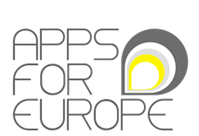
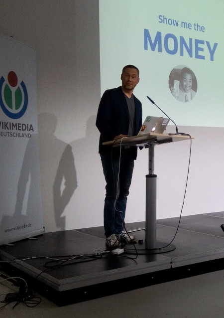

**Last week, we attended the closing event of [Apps for Europe](http://www.appsforeurope.eu/) in Berlin. Over the course of two days, we evaluated the project that encouraged creators of Open Data apps to turn their ideas into a viable business. Our conclusion? We consider Apps4EU a success, it definitely had a positive influence on the Open Data business scene.**

In a nutshell, Apps for Europe is a **support network** for organisers of competitions using Open Data and stimulates hackathon winners in converting their concept into a viable **business**. Thus socio-economic value is created and the benefits of Open Data can flourish. Top-notch projects can enter in a pan-European competition, putting local initiatives under an **European** spotlight.

#### Round up

On the 10th and 11th of June, we took the time to look back at Apps4EU and its outcomes, together with 18 other European countries. To keep this all breezy and blithe, the coordinating organisation made use of rather unusual evaluation and brainstorm techniques such as the ideation tool [HatParty](http://hatparty.eu/) for example. Let me assure you that you want to stay in the running with that one!  
For the first night, we joined the **Startup acceleration event** in the Wikimedia offices, co-organised by [ODIne](http://opendataincubator.eu/) and [Finodex](http://www.finodex-project.eu/). Fascinating speeches were given and we even got a keynote from Nicolas Zimmer, chairman of the [Technology Foundation Berlin](https://www.technologiestiftung-berlin.de/en/home/).

#### Impact on Open Data

What were the Apps for Europe results after two years? Apps4EU has had its influence on the **Open Data business environment**. You can see that by looking at the promosing start-ups that got a boost through Apps4EU. A few examples are

- [Ally](http://www.allyapp.com/)
- [Plume Labs](https://www.plumelabs.com/)
- [GoOV](http://www.go-ov.nl/)
- [Geostep](http://www.geostep.me/)
- [Europeana Beacon](http://www.oimmei.com/europeana/europeana-beacon.html/)

The focus of hackathons has also shifted from technical completion towards integrated concepts, innovation and business models. If we want to convert ideas and concepts into viable businesses, a more **structural support** for hackathons should be offered instead of a one-time incentive. Coaching, courses and workshops instead of prizes and gadgets. Hence the [Business Lounge concept](https://waag.org/sites/waag/files/public/media/publicaties/business-lounge-guide.pdf) of Apps for Europe.

During Apps for Europe, we could notice that

- SLA companies revolving around Open Source products arose, like [We Open Data](http://weopendata.com/)
- marketplaces for alghoritms using Open Data, for instance [Cloud ‘n Sci](http://cloudnsci.fi/), can work
- and even hardware/software projects such as [Mnemosyne](http://mnemosyne-app.de/) can flourish

And that shows there is more to Open Data startups than just ‘Apps’. There are many diverse European start-ups that can use Open Data into their product and service. Apps for Europe has provided a **first framework** to locate and stimulate these opportunities. Now it is time to build upon that knowledge and improve upon this format to **support Open Data businesses** in creating new and better digital solutions.
