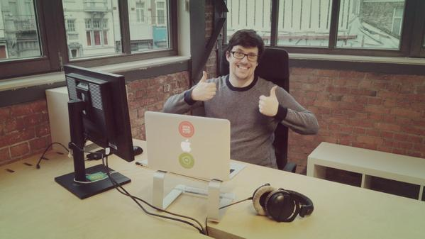
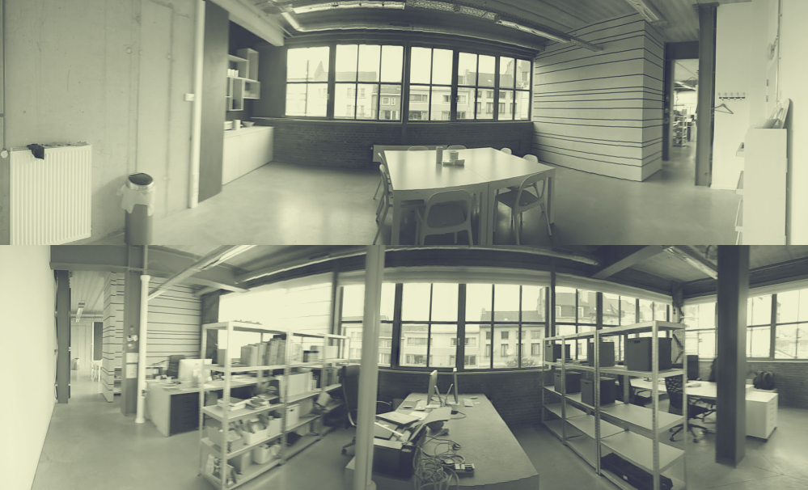

**It’s official, after working at the iMinds Start-Up Garage for two years we moved out to look for something we could call our own in the center of Ghent. Earlier last month we released a [blogpost asking for office-leads in Ghent](http://www.openknowledge.be/2015/09/02/looking-for-open-knowledge-hq/). The search was trickier then we thought but the huge response on Twitter did help us a lot.**

### Big response, big ask

Having a lot of options was a big luxury, but not a lot of those options came from standard real-estate websites or brokers. No, a lot of leads came through personal contacts, and guys who knew a guy who might have a space available. The most striking thing though, was that a lot of other non-profits, small companies, startups and freelancers actually contacted us looking for a place to stay. They asked us whether they could get the contacts for offices that didn’t suit our needs. So we did notice that small offices are really hard to come by in Ghent, while co-working spaces are not overpacked. Maybe there’s a middle ground solution that is still in the making?

### Big ask because of big prices

An own office seemed the way to go at first but after seeing the sixth overly expensive or badly located office, we gave up. We even started to do our research and found out that prices are way up since a couple of years. The article on [Nieuwsblad in 2013](http://www.nieuwsblad.be/cnt/dmf20130117_00437048) talks about an average price of 116 euro per year per square meter. 2 years later we encountered small offices that had an asking price of up to 367 euro per year per square meter. That’s a 300% rise people! The disclaimer here is that this office did have shared spaces such as restrooms, meetings rooms and kitchenettes not included in the square metres, but still a lot of money if you had to pay electricity, gas, water and internet subscription on top of that cost. We even considered ‘Anti-kraak’, which is a temporary housing solution against illegal squatting, offering spaces for a small fee, but the short notice period and amount of furniture we would’ve had to buy didn’t make enough sense for us. For the adventurous amongst ourselves: [vastgoedbeheer.com](ttp://www.vastgoedbeheer.com). Feel free to try.

### Shared office vs. Co-working

That’s why we went to look for a different possibility that suited our needs, expectations and organisational structure. Co-working spaces were also an option as we are used to nest between start-up companies in big communal spaces, but it’s a financial setup that is quite hard for non-profits. For a one man organisation it would be a cheap alternative, but with interns, volunteers and students coming and going all the time it’s hard to keep up how many people work with us. And booking a meeting room each time somebody walks through the door would be too time consuming. So we’re happy to find a shared office where we could rent a full desk space in stead of having to rent a full office or just one resident seat.

### New office, open office.

We chose a shared office at the [Dok-Noord](http://www.doknoord.be/) site in the North of Ghent. A shared office means we rent a desk for up to four people in a communal office space. So we have plenty of room to invite volunteers, jobstudents and board members to come and work with us on projects, tools and more. At the same time we have wonderful neighbours like [Mojoville](http://www.mojoville.be/) and [Studio Iris](http://www.studioiris.be/) which makes the place a bit more vibrant.

All of that in the industrial space of [HAL26](http://www.doknoord.be/nieuws/algemeen/eerste-huurders-nemen-hun-intrek-in-hal-26), which almost sounds like a prequel for a Kubrick film.

### We could not have been here without iMinds

We want to finish off with props to iMinds, as they have been a wonderful host for our organisation for the past 2 years. Providing us with a space in the Start-Up Garage meant we could search how we could support Open Data efforts and how to grow as an organisation. We would not stand where we are now if not by the help of the whole iMinds team. So thank you guys and girls! For those who want their help as well: Feel free to check out [iStart](https://www.iminds.be/nl/business-ondersteuning/istart-incubatie-programma) incubation programme.

### Prepare for the future

Today we have an office that we can open up to our volunteers and coworkers. Tomorrow we hope to open something similar for all social and open innovation projects that use Open Data, create Open Source software or enable others to reuse their fruits of labour. We do not have the room for that yet, but we are working on a tool to kickstart this through crowdsourcing. More on that later. We’re also looking forward to [‘De Krook’](http://www.dekrook.be/), as it will be the Digital heart of Ghent. I wonder whether it will provide room (physical and digital) for a gathering of digital non-profits and social start-ups.
