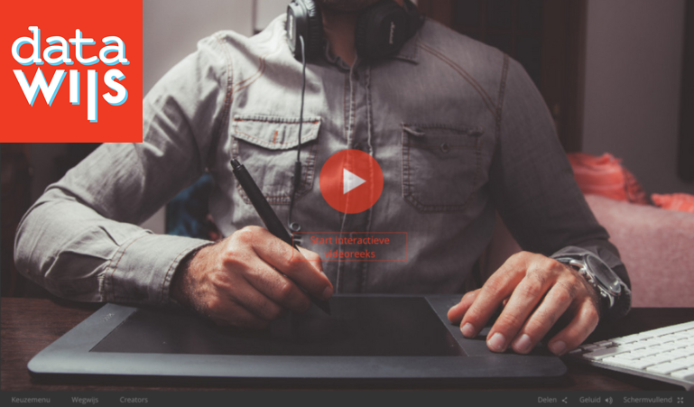

**Open data is gaining more importance these days. Yet, a lot of young people don’t know what open data is, or how they can benefit from it. That’s where [Datawijs](http://www.datawijs.be) comes in. It’s an interactive video series, that introduces teenagers and young adults to the concept of open data. The Belgian platform works with Klynt, which allows the young people to view the videos in the order they want to. Thanks to the non-linear structure, users can learn on their own pace, about what interests them at whatever time they have.**

Datawijs is developed in a way that every teen and young adult can **learn about and experiment** with open data, corresponding to their own needs. It has **three types of information layers**. First of all, there are the animated clips, which tells more about the open data subjects in an **introductory** way. Secondly, there’s the expert interviews, where experienced persons give more **in-depth** information on the subject. The third kind of videos are more **interactive** and encourages users to experiment with open data themselves. Whether it’s taking a quiz on open data or completing a data-search, young people can take their first steps in the open data matter. Datawijs even provides users with coding sites and open data portals, so that they can easily take it to the next level.

Datawijs is developed by us, Open Knowledge Belgium, with support of [Mediaraven](http://www.mediaraven.be/). They chose to focus on teenagers and young adults, age 15-25. Of course, the online platform isn’t exclusively available for that age group, as anyone is free to use it. But why exactly does Datawijs target young people? The **digital natives** of today are the data literates of tomorrow. On top of that, it’s also an age group that starts to invest their own **development** and self-actualisation.

Today, it can be quite hard for young people to find **easy-to-consume** information about open data online. Most info on that topic is too technical, static, fragmented or not in their maternal language. To them, open data may look like intangible, too theoretical and seemingly unimportant topic. Yet, non-technical and creative young people can be a great advantage. They can point out problems, select data based on their needs and give creative input on how to transform all this into an application. In order to facilitate this even more, the Datawijs series is in **Dutch**. This way, the Flemish youth is approached in their maternal language, making sure the language barrier is removed.

Addressing teenagers and young adults in a visual, interactive and non-linear manner, is a good way to make open data **easy approachable**. The clips are designed to engage young people to take their first steps in open data. Not only will they benefit from it, by having the opportunity to create what they need, but also **governments** most certainly gain advantage by this. Their open data is used in useful applications and visualisations. In the long run, the now well-informed teens and young adults may even ask to open up the data they need.

That’s why we consider it a must to transform digital natives into open data literates. The natives themselves and society benefit from it. By making the open data topic **lightweight** and easy to consume through an interactive video series, more young people might try to cross the open data bridge. It’s important open data becomes **truly open** to young people, as this will lead towards more and better use of it. Today, Datawijs is only available in Dutch. Luckily, the series is **open source**. We hope more versions of Datawijs will pop up in the near future, in order to reach out to digital natives everywhere.
