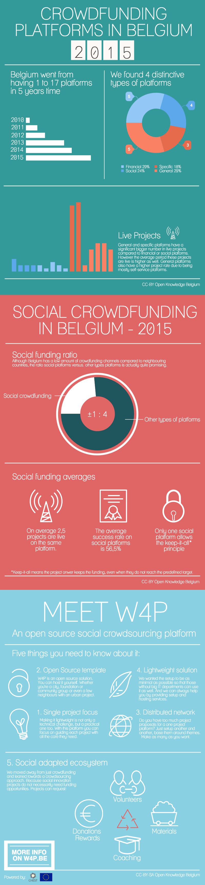

The crowdfunding market in Belgium is getting bigger every year and societal focused efforts are equally increasing, which we support with lots of enthusiasm. That’s why early 2014, iDROPS and Open Knowledge Belgium started to brainstorm on how we could potentially provide real added value in relation to more traditional crowdfunding channels.

## MEET W4P

Finally I can say we’re building our interpretation of the ideal platform for small to medium scale social, local and open innovation projects. And we’re not afraid to share the details before it’s finished, as sharing is the whole point. **Our Open Source template will give anyone access to a one-project-a-time platform to ask for funding, volunteers, coaches and/or materials.** That means you own the data AND the platform. And anyone does mean anyone, from cities and foundations to community or neigbourhood groups. If you can host it, you can own it. (Even if you can’t, we can always help along.)

The W4P stands for “We for purpose, we for people…”

## WE CELEBRATE WITH DATA

That’s not all. In our preliminary stage we did a first screening of the Belgian crowdfunding market, as crowdsourcing is still an early-stage concept, and we’ve gathered our key findings and data in the infograph below. Think we missed something? Have a look at our [spreadsheet](https://docs.google.com/spreadsheets/d/1UfELR-TJcnLK_YQbwjVG6T8terYMLp9WnA6BLVaEhlw/edit?usp=sharing) containing our online search results and let us know.

## WHAT CAN YOU EXPECT IN THE NEAR FUTURE?

We’re building on this project together with Open Knowledge Belgium, [iDROPS](http://idrops.be/) and [Underlined](https://underlined.be/) as we speak (I mean write). **The first pilot projects will launch in April and we will do a full release later this year.** Want to know more about this thing? Want to contribute? Want to setup an own instance of W4P? Just head over to **[W4P.be](http://w4P.be)** and contact us!

This project is being funded by the European Union’s Seventh Framework Programme through the [Chest-project Call 3](http://www.chest-project.eu/)

