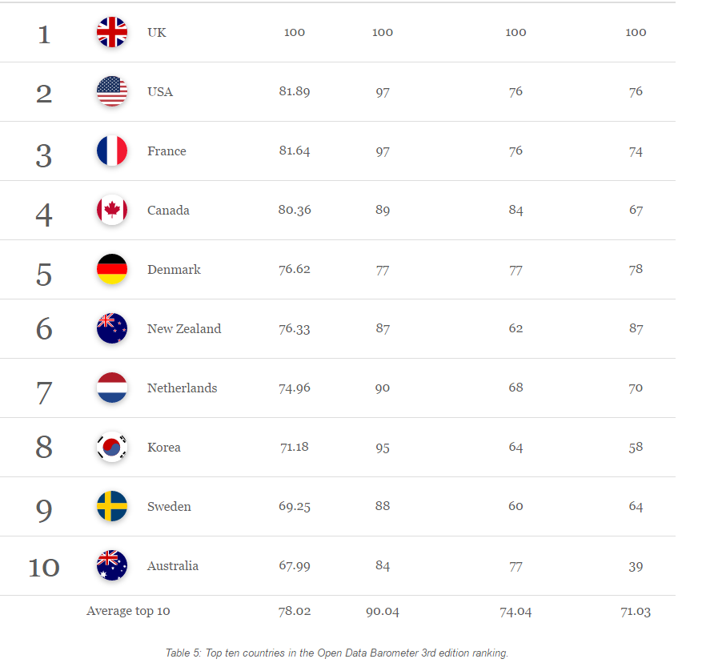

Yesterday the World Wide Web Foundation has released the [third edition of the Open Data Barometer](http://opendatabarometer.org/doc/3rdEdition/ODB-3rdEdition-GlobalReport.pdf). A collaborative research that covers 92 countries and ranks them by three key parameters: **readiness** (how prepared are governments regarding open data initiatives?), **implementation** (are governments putting their commitments into practice?) and **impact** (is open government data being used in ways that result in practical benefits?). Let’s take a closer look at how Belgium did this year.

**So is the glass half full or half empty?**

Belgium’s score is **52,62** out of 100 points which puts us half way through the open data barometer. Since the current edition is the third one, it allows us to search for trends in the country’s performance. For instance, 2014 was sort of a breakthrough year for many countries, with Belgium [jumping from 34,8 points to 47,29, whereas this year it is only 5,33 points higher](http://opendatabarometer.org/data-explorer/?_year=2015&indicator=ODB&open=BEL). Belgium is sharing the **22nd** position with Iceland (same as last year). This is still growth, although a detailed look at the data gives some food for thought.

**Up is down and down is up**

Throughout all three years that this research is being carried out, Belgium has been performing steadily in terms of readiness – 72, 86 and 80 points out of 100 in 2013, 2014 and 2015 respectively. Moreover, our state is performing better than average among its neighbors by parameters such as ‘Government Action’, ‘Citizens and Civil Rights’ and ‘Entrepreneurs and Business’.

At the same time, the scores for both ‘Readiness’ and ‘Implementations’ have slightly declined from 2014, which leaves ‘Impact’ as the sole parameter on which Belgium has actually progressed (from 30 to 48). This is actually good news, since impact was Belgium’s weakest point – and still is. ‘Political Impact’ is the parameter by which Belgium is performing much weaker than the average in the region of Europe and Central Asia. It received ‘0’ for the question ‘To what extent has open data had a noticeable impact on increasing government efficiency and effectiveness?’

**The neighborhood**

You might get jealous of France – and for a good reason. This country can provide you, not only cheese and wine, but a sheer amount of open data too, making it number 3 right next to the USA in the world ranking. Netherlands, on the contrary, lost one position in the ranking, descending to number 7. However, if you look at the top 10, you will find only 5 European countries up there. This might change even more: the new generation of open data adopters is going to challenge traditional stalwarts such as USA and UK. ‘The need to robust the data to drive democracy and development’ which is clear – is one of the key findings of the ODB.

**First world problems**

Now, you might call it a first world problem, but only being in the first quarter of the list can be not that great. What can Belgium do to not be stuck in the ranking, slowly backsliding while the other countries are catching up?

The unique bilingual setting of Belgium and the subsequent division and subdivision of its authorities are among the main reasons that explain its low impact performance. Whereas in the developing countries, the whole issue of governments opening their data is revolutionary, developed countries seem to suffer from inconsistencies between the readiness of society for open data and its impact.

This only proves the other key funding of the survey: the open data community needs to translate open data policy into real implementation. If we lose the moment, ‘open data could fade into a ghost town of abandoned pilots, outdated data portals and unused apps’.

The release of data per se is only the beginning of the story, not its end. You need individuals, communities and companies who can use and reuse the open data for good, which does not exclude their businesses by the way. You need general public awareness of open data, the same way it is being informed about the importance of having fresh water and clean air.

Open data has to stop being a geeky and nerdy term – it has to come to every house and make the difference on how you see the world. This is what they call impact.
