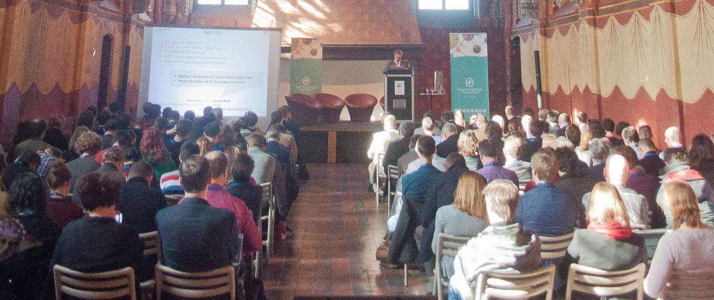
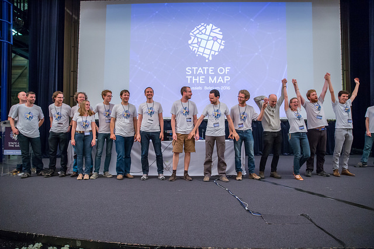
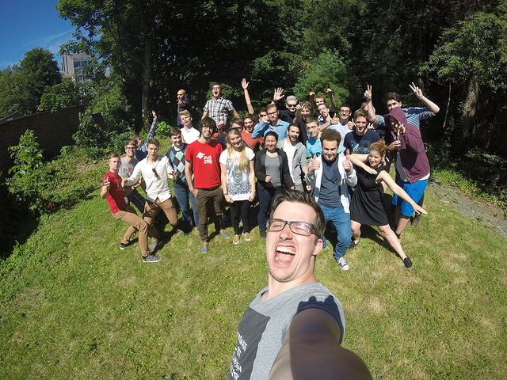

I remember it like yesterday, sitting in a bar to discuss joining Open Knowledge Belgium as a fulltime employee. I was a fresh off the boat social-media manager who believed in doing good through online community management. At the time I had no idea what Open Data was except for the [Wikipedia short description](https://en.wikipedia.org/wiki/Open_data), but I was sure it was something I could put my shoulders behind. Two and a half years later I now feel I’m ready to pass the torch. I’m preparing for a new challenge, which in response is a new opportunity for Open Knowledge Belgium. Finding someone equally or more enthused to take Open Knowledge Belgium to the next level.

### Let’s start the bragging part about my time at Open Knowledge Belgium.

Almost three years later I’ve organised 3 [conferences](http://2016.openbelgium.be/), bringing together 537 people(1), hosted 3 [open Summer of code editions](http://2016.summerofcode.be/) and hiring 68 students, co-organised 3 [Apps for Ghent editions](http://appsforghent.be/) bringing in ±250 hackers. I was an expert judge at least 8 hackathons, attended more than 15 as a coach. We co-created with other non-profits in making an interactive datawisdom tool ‘[Datawijs](http://datawijs.be/)’ for Flemish young people, making an Open Source Crowdsourcing tool [‘W4P’](http://w4p.be/) for social and open innovation projects and contributed to projects such as [SoloMIDEM](https://www.iminds.be/nl/projecten/SoloMIDEM) and [Apps for Europe](https://okfn.org/projects/apps-europe/). Combine that with smaller projects and experiments and you can understand why we need a new talent to take over. Our organisation is bad at not doing stuff.

### And now let me brag about what I didn’t do.

Our [five working groups](http://www.openknowledge.be/working-groups/) all have their own theme, approach and volunteers. Just last weekend, [OpenStreetMap Belgium](http://osm.be/) organised [State of the Map](http://2016.stateofthemap.org/) in Brussels, a three days festival with 450 visitors and 20+ volunteers limiting the chaos to a healthy level. I did nothing, except helping out as a volunteer myself. And only then my main task was to be amazed about their commitment and end result. I’ve been to Belgian Missing maps Mapathons, Opencon’s, iRail meetups and DataTank launches where I had no part in except cheering on.

 Picture of the amazing SOTM Volunteers,<bq>CC-BY Tatiana Van Campenhout</bq>

### So small organisation on paper, big on impact?

Exactly. It is a one employee organisation, but with a small army of contributors.

### So what will be the challenges for this new talent?

Our current focus is on dissemination, online communication and event management. Not only because the organisation requires these skills, but because those are the things I’m actually good at. That does mean that we try to see how different profiles could contribute to different actionables in the organisation. If you happen to be a more technical profile who is also willing to partake in the projects I just bragged about, then sure, you could be perfect for the job. The employee is not just a executing force, but someone who helps shape our mission and its outcomes.

### What is the state of OK-BE with you leaving?

Honestly, it has never been better. We have our own office, in which we can still be flexible, a decent daily management which mainly consists of board members who also want to help out in operational stuff, a big European project right at our doorstep, the growing Open Belgium community and happy #oSoc partners, coaches and students. Our financing is stable (I know we should open that up as an example) and we’re gaining more recurring partners and traction. Could our organisation be more professional? Sure, everyone involved is committed to the cause and are not professional non-profit managers, but we’re making great progress every day.

### If everything is going so well, then where are you going PJ?

Not going too far, I’m going to work for Digipolis Gent to help them make a sustainable smart and open city of my hometown Ghent. So I’ll still be around within the field of work. And besides that I’m sticking around as an active member of the organisation. Because I too still believe Open knowledge Belgium has a lot of potential.

### Have an insider insight PJ? How was working at Open Knowledge Belgium?

This has been and still is an amazing experience. Not because of the projects, the data, the cutting edge field(s) of work, the status… What truly is amazing about the organisation are the people. I’m not going to name people out of fear of forgetting some but if you see how dedicated people in our organisation are, you are in a daily awe. From the board, to contributors, to volunteers, to interns, to summer job students, to oSoc coaches, to … I’ve never before felt like I’m surrounded by so many talented people as I did when working for Open Knowledge Belgium.

 #oSoc15 Students kicking-ass CC-BY-SA OK-BE

It is what inspires me of using my techno optimism to build a better world. An open world where knowledge is open, usable, used and useful.

- Find the new job profile here: <http://www.openknowledge.be/jobs>
- If you’re not sure you fit that profile, Skype me to discuss it: ‘pieterjanpauwels’
- Come say hello on my farewell after-work drink on 25 November in Ghent: <https://opendrinks.eventbrite.nl>
- And if you think I missed a fake blog question above, you can also mail me: <pieterjan@openknowledge.be>
