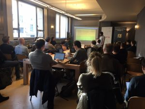

**Last week Open Knowledge Belgium launched, in collaboration with Wikimedia Belgium, Civic Lab Brussels, a biweekly action-oriented gathering of open enthusiasts with different backgrounds and skills who work together on civic projects.**

<iframe allowfullscreen="" frameborder="0" height="356" marginheight="0" marginwidth="0" scrolling="no" src="https://www.slideshare.net/slideshow/embed_code/key/1tZYePo9y213Ho" style="border:1px solid #CCC; border-width:1px; margin-bottom:5px; max-width: 100%;" width="427"> </iframe>

  **[Introduction to Civic Lab Brussels](https://www.slideshare.net/DriesVanRansbeeck/introduction-to-civic-lab-brussels "Introduction to Civic Lab Brussels")**  from **[Dries Van Ransbeeck](https://www.slideshare.net/DriesVanRansbeeck)** 
 **How did we come up with this idea?**

It all started during a fruitful discussion with Open Knowledge Germany at Open Belgium earlier in March. While talking about the [26 OK Labs](https://codefor.de/) in Germany, more specifically being intrigued by the air quality project of [OK Lab Stuttgart](https://www.meetup.com/OK-Lab-Stuttgart-Meet-Up/), we got to ask ourselves: why wouldn’t we launch something similar in Brussels/Belgium?

In about the same period of time, some new open initiatives popped up from within our community and several volunteers repeatedly expressed their interest to contribute to Open Knowledge’s mission of building a world in which knowledge creates power for the many, not the few.

Eventually, after a wonderful visit to [BeCentral](http://www.becentral.org/) – the new digital hub above Brussels’ central station – all pieces of the puzzle got merged into the idea of a Civic Lab: bringing volunteers and open projects every 2 weeks together in an open space.

**Much more than putting open projects in the picture**

The goal of Civic Labs Brussels is two-fold: on the one hand, offering volunteers opportunities to contribute to civic projects they care about. On the other hand, providing initiative-takers of open project with help and advice from fellow citizens.

Open in the case of our Civic Lab means, corresponding to the [Open Definition](http://opendefinition.org/), yet slightly shorter, that anyone can freely contribute to and benefit from the project. No strings attached.

During our Civic Lab meetups we don’t only put open initiatives in the picture and hang out with other civic innovators. We also want to get things done and create impact. Therefore, our meetups always take place under the same format of short introductory presentations (30 min) — to both new and ongoing projects — followed by action (2 hours), whereby all attendees are totally free to contribute to the project of their choice and can come up with new projects — just let the organising team know in advance.

**Kickoff Civic Hack Night**

At our kickoff meetup we were pleased to welcome 33 open believers — what corresponds to a show-up rate of 92% (!)— and had 4 projects presented:

- Open Food Data \[[more details](https://github.com/openthings-cc/FarmFood-Interoperability)\]
- Air Quality Brussels \[[presentation](https://docs.google.com/a/kwintenlambrecht.com/presentation/d/1yOz8MsxetrSQJ1Wfy4LwIQwKyESt6jcVuRe68M7IvIE/edit?usp=sharing)\]
- OpenStreetMap Belgium \[[projects](http://www.osm.be/en/projects/)\]
- Open Government Spending \[triggered by [this article](https://www.nytimes.com/2017/04/17/business/dealbook/steve-ballmer-serves-up-a-fascinating-data-trove.html?mwrsm=LinkedIn)\]

Thanks to the diversity among attendees, our kickoff meetup turned out to be a big success. This is also where the potential lies for Civic labs: bringing researchers, hackers, civil servants, entrepreneurs and civil society representatives in the same room and inviting them to collaboratively work on open projects.

Civic Labs Brussels Kickoff

**What to expect from our next Civic Lab meetups?**

During our next open gathering there will be presentations about both running projects —e.g. air quality, OpenStreetMap and open food data — as well new projects in Civic Lab Brussels as, for instance, from Wikimedia Belgium and Dewey.

Next to those project-specific presentations, we’d like to invite researchers and students to come and tell us about their findings from their work related to anything open and international visitors to meet our local community and share their stories. Last but not least, we’re happy to announce that Chris and Umut, both interns at Open Knowledge Belgium, will also present the onboarding process they developed for [W4P](http://w4p.be/) – open source crowdsourcing platform – during the [Civic Lab meetup on 23 May](https://www.meetup.com/Civic-Lab-Brussels/events/239487497/).

**How to get involved:**

- Join [Civic Lab Brussels on Meetup](https://www.meetup.com/Civic-Lab-Brussels/) and [Civic Lab Belgium on Slack](http://slack.civiclabs.be).
- Come contribute to open projects, or present yours, at one of our [next biweekly meetups](https://www.meetup.com/Civic-Lab-Brussels/events/239334537/) at BeCentral.
- Other fresh ideas? Please let us know via [@openknowledgebe](https://twitter.com/OpenKnowledgeBE) or dries@openknowledge.be.

Noteworthy: Civic Lab Brussels has its own Wiki page – [https://be.wikimedia.org/wiki/Civic_Lab_Brussels](https://be.wikimedia.org/wiki/Civic_Lab_Brussels)
