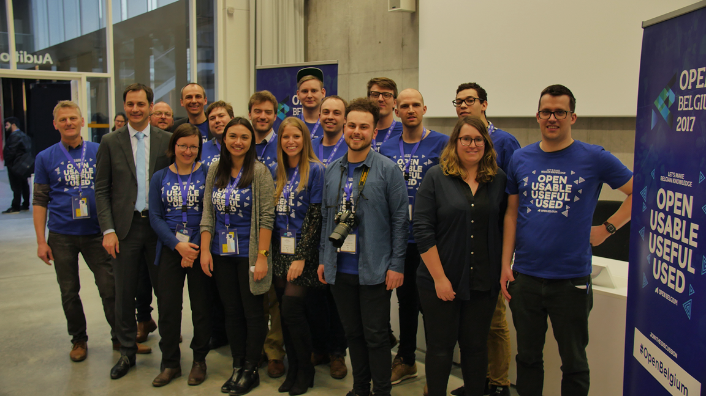

**In the last few months, the open community in Belgium has had the chance to gather multiple times. Open Knowledge Belgium organised a couple of events and activities which aimed to bring its passionate community together and facilitate the launch of new projects. Furthermore, as summertime is coming, it’s currently organising the seventh edition of its yearly open Summer of code. Let’s go chronologically through what’s going on at Open Knowledge Belgium.**

**Open Belgium 2017**

As the tradition goes, the first Monday after International Open Data Day, Open Knowledge Belgium organises its Open Belgium conference on open knowledge and open data in Belgium.

<figure class="graf graf--figure"><figcaption class="imageCaption">Open Belgium was made possible by an incredible group of volunteers</figcaption></figure>This year’s community-driven gathering of open enthusiasts took place in Brussels for the first time and was a big success. More than 250 people with different backgrounds showed up to talk about the current state of and next steps towards more open knowledge and open data in Belgium.

<iframe allowfullscreen="" frameborder="0" height="356" marginheight="0" marginwidth="0" scrolling="no" src="https://www.slideshare.net/slideshow/embed_code/key/CHu5InX3faGGVW" style="border:1px solid #CCC; border-width:1px; margin-bottom:5px; max-width: 100%;" width="427"> </iframe>

  **[Overview Open Belgium 2017](https://www.slideshare.net/OpenKnowledgeBE/overview-open-belgium-2017 "Overview Open Belgium 2017")**  from **[Open Knowledge Belgium](https://www.slideshare.net/OpenKnowledgeBE)** 
All presentations, notes and visuals of Open Belgium are available on <http://2017.openbelgium.be/presentations>.

**Launch of Civic Lab Brussels**

It all started during a fruitful discussion with Open Knowledge Germany at Open Belgium. While talking about the 26 OK Labs in Germany, more specifically being intrigued by the air quality project of OK Lab Stuttgart, we got to ask ourselves: why wouldn’t we launch something similar in Brussels/Belgium?

In about the same period of time, some new open initiatives popped up from within our community and several volunteers repeatedly expressed their interest to contribute to Open Knowledge’s mission of building a world in which knowledge creates power for the many, not the few.

Eventually, after a wonderful visit to [BeCentral](http://www.becentral.org/) — the new digital hub above Brussels’ central station — all pieces of the puzzle got merged into the idea of a Civic Lab: bringing volunteers and open projects every 2 weeks together in an open space.

<iframe allowfullscreen="" frameborder="0" height="356" marginheight="0" marginwidth="0" scrolling="no" src="https://www.slideshare.net/slideshow/embed_code/key/1tZYePo9y213Ho" style="border:1px solid #CCC; border-width:1px; margin-bottom:5px; max-width: 100%;" width="427"> </iframe>

  **[Introduction to Civic Lab Brussels](https://www.slideshare.net/DriesVanRansbeeck/introduction-to-civic-lab-brussels "Introduction to Civic Lab Brussels")**  from **[Dries Van Ransbeeck](https://www.slideshare.net/DriesVanRansbeeck)** 
The goal of Civic Labs Brussels is two-fold: on the one hand, offering volunteers opportunities to contribute to civic projects they care about. On the other hand, providing initiative-takers of open project with help and advice from fellow citizens.

Open in the case of our Civic Lab means, corresponding to the [Open Definition](http://opendefinition.org/), yet slightly shorter, that anyone can freely contribute to and benefit from the project. No strings attached.

Civic Lab meetups are not only to put open initiatives in the picture and hang out with other civic innovators. They’re also about getting things done and creating impact. Therefore, those gatherings always take place under the same format of short introductory presentations (30 min) — to both new and ongoing projects — followed by action (2 hours), whereby all attendees are totally free to contribute to the project of their choice and can come up with new projects.

**Open Summer of code 2017**

Last but not least, Open Knowledge Belgium is preparing for the seventh edition of its annual [open Summer of code](http://2017.summerofcode.be/). From 3rd until 27th July, 36 programming, design and communications students will be working under the guidance of experienced coaches on 10 different open innovation projects with real-life impact.

<iframe allowfullscreen="" frameborder="0" height="338" mozallowfullscreen="" src="https://player.vimeo.com/video/188284459" webkitallowfullscreen="" width="600"></iframe>
If you want to stay updated about open Summer of code and all other activities, please follow [Open Knowledge Belgium on Twitter](https://twitter.com/OpenKnowledgeBE) or subscribe to its [newsletter](https://www.openknowledge.be/#subform).
