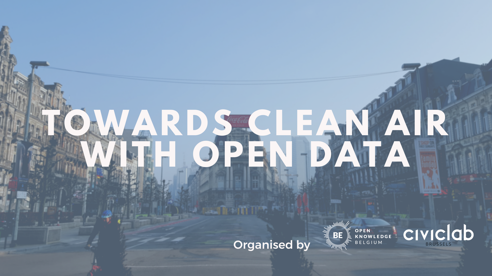

On Saturday **3rd March** took place the Open Data Day, for the occasion, no less than 355 events occurred around the globe. One of them, “Towards Clean Air with Open Data!”, happened in BeCentral in Brussels.

During the _morning_, 8 talks on open air quality data were given by citizens, experts, students and entrepreneurs. They talked about different initiatives in Belgium, the effects on health of air pollution, and more. You can find the links to the slides of the presentations below, also, everything was recorded so the talks will be available soon on our [Youtube Channel](https://www.youtube.com/channel/UCXSJAzi8EW3PXBBrYJTDSOw).

In the _afternoon_, two workshops were given:

- Analyzing and visualizing open air quality data
- Build your own sensor

The first one lasted around two hours, it was given by _Dominik Rubo_ who knows a lot about open air quality data analysis and visualization. By the end of the workshop, people were able to **extract the data provided by the sensors, analyse it and visualize it**. If you’re interested, you can find the github link to do it yourself [here](https://github.com/dr-1/air-data-workshop).

The second one, given by _Yannick Verbelen and Pieter Van der Vennet_, aimed at **teaching people how to build their own sensor** so they would only need to plug it in at home to be operational. Thanks to this workshop, they managed to build **22 sensors** that are probably collecting data now. We expect that more and more workshops of this kind will take place in different cities so we will have a better understanding of air quality in Belgium. You couldn’t come at the workshop and you **can’t wait to build your own sensor?** [Here](http://influencair.be/build-your-sensor/) is a complete tutorial with resources to order the pieces and build it at home!

The event finished on a cold beer in the end of the afternoon to relax after this extensive program. It is awesome to see the _dedication_ people put in such project during their free time. The success of such event is a good indicator that _open air quality data has a bright future in Belgium._

If you want to actively **join the movement**, Civic Lab Brussels members work on air quality measurements every other Tuesday. Join our [meetup page](https://www.meetup.com/fr-FR/Civic-Lab-Brussels/) to learn more about it! We are looking for technical _and_ non-technical people, so come as you are whatever your skills are.

The next coming event is **Open Belgium 2018,** it will take place in Louvain-la-Neuve on the 12th March. If you are interested not only in air quality but in open data in general, you will definitely enjoy it. Don’t hesitate to [visit the website](http://2018.openbelgium.be/) to learn more about it and book your ticket!

**Resources:**

- [Pictures of the event](https://www.flickr.com/photos/okfn-belgium/albums/72157694143122795)
- [Analyzing and visualizing open air quality data](https://github.com/dr-1/air-data-workshop)
- [How to build your own sensor](http://influencair.be/build-your-sensor/)
- [Recordings of the talks (coming soon!)](https://www.youtube.com/channel/UCXSJAzi8EW3PXBBrYJTDSOw)

**Presentations’ slides:**

- [Dries Van Ransbeeck &amp; Evelyn De Wachter – InfluencAir, citizens measuring air quality in Brussels](https://www.slideshare.net/OpenKnowledgeBE/influencair-citizens-measuring-air-quality)
- [Carina Veeckman – Participatory processes for air quality measurements through hackAIR](https://www.slideshare.net/OpenKnowledgeBE/participatory-processes-for-air-quality-measurements-through-hackair)
- [Tim Cassiers – Air quality projects by BRAL, a citizen movement in Brussels](https://www.slideshare.net/OpenKnowledgeBE/from-citizen-science-towards-coconstructed-air-policies-in-brussels)
- [Olav Peeters – Hosting open data endpoints at IRCEL-CELINE serving air quality data from the three Belgian regional government measurement networks>](https://www.slideshare.net/OpenKnowledgeBE/hosting-open-data-endpoints-at-ircelceline-serving-air-quality-data-from-the-three-belgian-regional-government-measurement-networks)
- [Thomas Duvivier – The potential impact of a citizen-driven air quality measurement project](https://www.slideshare.net/OpenKnowledgeBE/the-potential-impact-of-a-citizendriven-air-quality-measurement-project)
- [Vlatka Matkovic – Air quality and its implications on our health](https://www.slideshare.net/OpenKnowledgeBE/air-quality-and-its-implications-on-our-health)
- [Maarten Reyniers – Citizen project for mapping air quality in Leuven at high spatial resolution](https://www.slideshare.net/OpenKnowledgeBE/a-citizen-project-for-mapping-air-quality-in-leuven-at-high-spatial-resolution)
